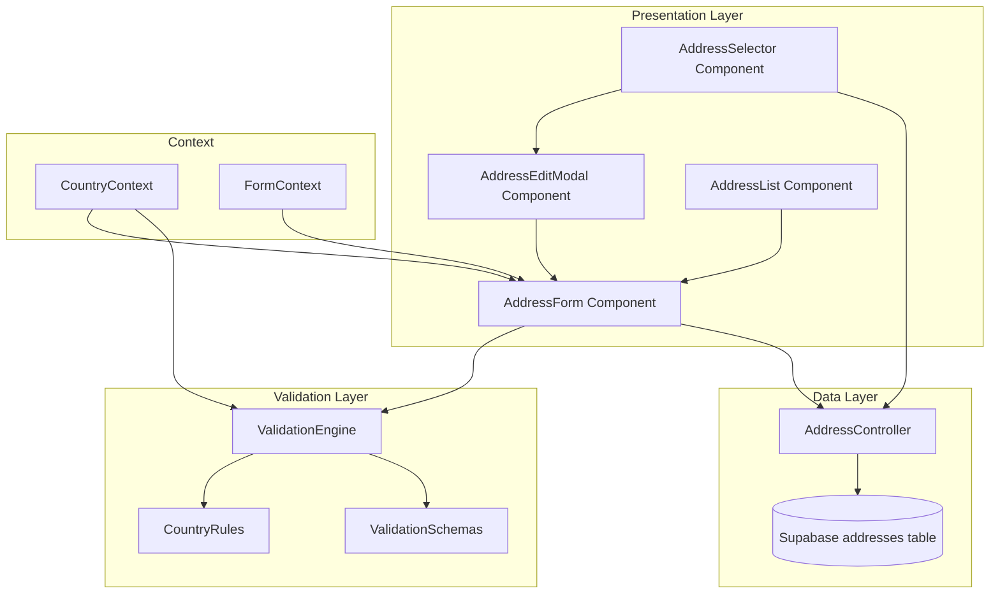

# Design Document: Address Management Enhancement

## Overview

This design enhances the address management system for the Tenunan Songket e-commerce application by improving validation, user experience, and localization for the Brunei market. The solution maintains backward compatibility with the existing Supabase database schema while introducing country-aware validation, inline editing during checkout, and mobile-optimized interfaces.

The design follows a component-based architecture with three main layers:
1. **Presentation Layer**: React components for address forms and selectors
2. **Validation Layer**: Country-aware validation engine with real-time feedback
3. **Data Layer**: Supabase integration maintaining existing schema

Key design principles:
- **Progressive Enhancement**: New features work alongside existing functionality
- **Mobile-First**: Responsive design optimized for touch interfaces
- **Localization**: Country-specific labels and validation rules
- **Real-Time Feedback**: Immediate validation as users type
- **Accessibility**: WCAG 2.1 AA compliant form controls

## Architecture

### System Architecture



### Component Hierarchy

```
CheckoutPage
├── AddressSelector
│   ├── AddressCard (selected)
│   ├── AddressEditModal
│   │   └── AddressForm
│   └── AddressList
│       └── AddressCard (multiple)
│
ProfilePage
└── AddressList
    ├── AddressCard (multiple)
    └── AddressForm
```

### Data Flow

1. **Address Creation/Edit Flow**:
   - User interacts with AddressForm
   - FormContext manages form state
   - ValidationEngine validates in real-time
   - CountryContext provides country-specific rules
   - AddressController saves to Supabase
   - Success feedback displayed

2. **Checkout Edit Flow**:
   - User clicks "Edit" in AddressSelector
   - AddressEditModal opens with AddressForm
   - Validation occurs inline
   - Save updates database and closes modal
   - AddressSelector refreshes with updated data

## Components and Interfaces

### 1. ValidationEngine

The core validation system that applies country-specific rules.

**Interface**:
```typescript
interface ValidationEngine {
  validateField(
    fieldName: string,
    value: string,
    countryCode: string
  ): ValidationResult;
  
  validateForm(
    formData: AddressFormData,
    countryCode: string
  ): FormValidationResult;
  
  sanitizeInput(
    value: string,
    fieldType: FieldType
  ): string;
}

interface ValidationResult {
  isValid: boolean;
  errorMessage?: string;
  sanitizedValue?: string;
}

interface FormValidationResult {
  isValid: boolean;
  fieldErrors: Record<string, string>;
}
```

**Responsibilities**:
- Apply country-specific validation rules
- Provide real-time validation feedback
- Sanitize user inputs
- Generate user-friendly error messages

**Validation Rules by Country**:

```typescript
interface CountryRules {
  BN: {
    phone: /^\+673-\d{3}-\d{4}$|^\d{3}-\d{4}$/,
    postalCode: /^[A-Z]{2}\d{4}$/,
    labels: {
      city: "Bandar",
      state: "Daerah/Mukim",
      postalCode: "Poskod",
      phone: "Nombor Telefon"
    }
  },
  MY: {
    phone: /^\+60\d{1,2}-\d{7,8}$/,
    postalCode: /^\d{5}$/,
    labels: {
      city: "Bandar",
      state: "Negeri",
      postalCode: "Poskod",
      phone: "Nombor Telefon"
    }
  },
  SG: {
    phone: /^\+65-\d{4}-\d{4}$/,
    postalCode: /^\d{6}$/,
    labels: {
      city: "City",
      state: "District",
      postalCode: "Postal Code",
      phone: "Phone Number"
    }
  },
  ID: {
    phone: /^\+62\d{2,3}-\d{6,8}$/,
    postalCode: /^\d{5}$/,
    labels: {
      city: "Kota",
      state: "Provinsi",
      postalCode: "Kode Pos",
      phone: "Nomor Telepon"
    }
  }
}
```

### 2. AddressForm Component

Enhanced form component with validation and country awareness.

**Interface**:
```typescript
interface AddressFormProps {
  initialData?: Address;
  onSave: (address: Address) => Promise<void>;
  onCancel?: () => void;
  context: 'profile' | 'checkout';
  mode: 'create' | 'edit';
}

interface AddressFormData {
  label: string;
  recipientName: string;
  phone: string;
  addressLine1: string;
  addressLine2?: string;
  city: string;
  state: string;
  postalCode: string;
  country: string;
  isDefault: boolean;
}

interface AddressFormState {
  formData: AddressFormData;
  errors: Record<string, string>;
  touched: Record<string, boolean>;
  isSubmitting: boolean;
  isDirty: boolean;
}
```

**Features**:
- Real-time validation with debouncing (300ms)
- Country-aware field labels
- Progressive disclosure on mobile
- Accessible form controls (ARIA labels)
- Touch-optimized inputs (44px minimum)

**Form Sections**:
1. **Recipient Information**: label, recipientName, phone
2. **Address Details**: addressLine1, addressLine2, city, state, postalCode, country
3. **Additional Information**: isDefault checkbox

### 3. AddressEditModal Component

Modal dialog for inline address editing during checkout.

**Interface**:
```typescript
interface AddressEditModalProps {
  address: Address;
  isOpen: boolean;
  onClose: () => void;
  onSave: (address: Address) => Promise<void>;
}
```

**Features**:
- Overlay with backdrop
- Escape key to close
- Click outside to close (with unsaved changes warning)
- Mobile-responsive (full screen on small devices)
- Focus trap for accessibility

### 4. AddressSelector Component

Enhanced selector with inline edit capability.

**Interface**:
```typescript
interface AddressSelectorProps {
  addresses: Address[];
  selectedAddressId?: string;
  onSelect: (addressId: string) => void;
  onAddressUpdated: (address: Address) => void;
}
```

**Features**:
- Display selected address prominently
- "Edit" button next to selected address
- "Add New Address" option
- Radio button selection for accessibility

### 5. CountryContext

React context providing country-specific configuration.

**Interface**:
```typescript
interface CountryContextValue {
  selectedCountry: CountryCode;
  setSelectedCountry: (country: CountryCode) => void;
  getFieldLabel: (field: string) => string;
  getValidationRule: (field: string) => RegExp;
  getPlaceholder: (field: string) => string;
  getHelperText: (field: string) => string;
}

type CountryCode = 'BN' | 'MY' | 'SG' | 'ID';
```

### 6. AddressController

Data access layer for address operations.

**Interface**:
```typescript
interface AddressController {
  createAddress(
    userId: string,
    addressData: AddressFormData
  ): Promise<Address>;
  
  updateAddress(
    addressId: string,
    addressData: Partial<AddressFormData>
  ): Promise<Address>;
  
  getAddresses(userId: string): Promise<Address[]>;
  
  getAddress(addressId: string): Promise<Address>;
  
  deleteAddress(addressId: string): Promise<void>;
  
  setDefaultAddress(
    userId: string,
    addressId: string
  ): Promise<void>;
}
```

**Implementation Notes**:
- Uses existing Supabase schema (no migrations needed)
- Handles is_default flag updates (only one default per user)
- Soft deletes using is_deleted flag
- Returns sanitized data

## Data Models

### Address Model

```typescript
interface Address {
  id: string;                    // UUID
  userId: string;                // UUID (user_id in DB)
  label: string;                 // "Rumah", "Kantor", etc.
  recipientName: string;         // recipient_name in DB
  phone: string;
  addressLine1: string;          // address_line1 in DB
  addressLine2?: string;         // address_line2 in DB
  city: string;
  state: string;
  postalCode: string;            // postal_code in DB
  country: string;               // 'BN', 'MY', 'SG', 'ID'
  isDefault: boolean;            // is_default in DB
  isDeleted: boolean;            // is_deleted in DB
  createdAt: Date;               // created_at in DB
}
```

**Field Constraints**:
- `label`: max 50 characters, required
- `recipientName`: max 100 characters, required
- `phone`: country-specific format, required
- `addressLine1`: max 200 characters, required
- `addressLine2`: max 200 characters, optional
- `city`: max 100 characters, required
- `state`: max 100 characters, required
- `postalCode`: country-specific format, required
- `country`: enum ['BN', 'MY', 'SG', 'ID'], required, default 'BN'

### Validation Schema

```typescript
interface ValidationSchema {
  field: string;
  rules: ValidationRule[];
}

interface ValidationRule {
  type: 'required' | 'pattern' | 'maxLength' | 'custom';
  value?: any;
  message: string;
  validator?: (value: string) => boolean;
}

// Example schema for phone field
const phoneValidationSchema: ValidationSchema = {
  field: 'phone',
  rules: [
    {
      type: 'required',
      message: 'Phone number is required'
    },
    {
      type: 'pattern',
      value: /^\+673-\d{3}-\d{4}$|^\d{3}-\d{4}$/,  // Brunei format
      message: 'Phone number must be in format +673-XXX-XXXX or XXX-XXXX'
    }
  ]
};
```

### Form State Model

```typescript
interface FormState {
  values: AddressFormData;
  errors: Record<string, string>;
  touched: Record<string, boolean>;
  isValidating: boolean;
  isSubmitting: boolean;
  isDirty: boolean;
  isValid: boolean;
}
```

### Country Configuration Model

```typescript
interface CountryConfig {
  code: CountryCode;
  name: string;
  phonePattern: RegExp;
  phoneExample: string;
  postalCodePattern: RegExp;
  postalCodeExample: string;
  labels: {
    city: string;
    state: string;
    postalCode: string;
    phone: string;
  };
  helperText: {
    phone: string;
    postalCode: string;
  };
}

// Example configuration
const bruneiConfig: CountryConfig = {
  code: 'BN',
  name: 'Brunei Darussalam',
  phonePattern: /^\+673-\d{3}-\d{4}$|^\d{3}-\d{4}$/,
  phoneExample: '+673-123-4567',
  postalCodePattern: /^[A-Z]{2}\d{4}$/,
  postalCodeExample: 'BB1234',
  labels: {
    city: 'Bandar',
    state: 'Daerah/Mukim',
    postalCode: 'Poskod',
    phone: 'Nombor Telefon'
  },
  helperText: {
    phone: 'Format: +673-XXX-XXXX atau XXX-XXXX',
    postalCode: 'Format: XX1234 (contoh: BB1234)'
  }
};
```


## Correctness Properties

*A property is a characteristic or behavior that should hold true across all valid executions of a system—essentially, a formal statement about what the system should do. Properties serve as the bridge between human-readable specifications and machine-verifiable correctness guarantees.*

### Validation Properties

**Property 1: Phone Number Format Validation**
*For any* phone number string and country code, when validated by the Validation_Engine, valid formats for that country should pass validation and invalid formats should fail validation.
**Validates: Requirements 1.1**

**Property 2: Validation Error Messages**
*For any* invalid input and field type, when validation fails, the Validation_Engine should return an error message that includes the expected format or value.
**Validates: Requirements 1.2, 2.2, 12.4**

**Property 3: Form Submission Blocking**
*For any* form data with validation errors, when the user attempts to submit, the System should prevent submission and highlight all fields with errors.
**Validates: Requirements 1.4, 2.5, 11.3**

**Property 4: Postal Code Format Validation**
*For any* postal code string and country code, when validated by the Validation_Engine, valid formats for that country should pass validation and invalid formats should fail validation.
**Validates: Requirements 2.1**

### Sanitization Properties

**Property 5: Input Sanitization**
*For any* input string, when sanitized by the Validation_Engine, harmful special characters should be removed while preserving safe characters (hyphens, commas, periods, apostrophes).
**Validates: Requirements 3.1, 3.3**

**Property 6: Length Truncation**
*For any* input string exceeding the maximum length for a field, the Address_Form should truncate the input at the character limit.
**Validates: Requirements 3.2**

**Property 7: Sanitization Before Save**
*For any* address form submission, all input fields should be sanitized before being stored in the database.
**Validates: Requirements 3.4**

**Property 8: Whitespace Trimming**
*For any* text input with leading or trailing whitespace, the System should trim the whitespace before validation and storage.
**Validates: Requirements 3.5**

### Data Persistence Properties

**Property 9: Address Update Persistence**
*For any* valid address update during checkout, when saved, the database should be updated and the Address_Selector should reflect the changes without leaving the checkout flow.
**Validates: Requirements 4.4**

**Property 10: Cancel Preserves Data**
*For any* address being edited, when the user cancels the edit operation, the original address data should remain unchanged.
**Validates: Requirements 4.5**

### Country Context Properties

**Property 11: Country-Specific Labels**
*For any* country selection, when the Country_Context changes, all field labels should update to match that country's terminology.
**Validates: Requirements 7.3**

**Property 12: Country-Specific Validation Rules**
*For any* country selection, when the Country_Context changes, the Validation_Engine should apply that country's validation rules for phone numbers and postal codes.
**Validates: Requirements 7.4, 8.4**

**Property 13: Form Data Preservation on Country Change**
*For any* form data and country selection change, all user-entered data in form fields should be preserved after the country change.
**Validates: Requirements 8.5**

### UI Properties

**Property 14: Required Field Indicators**
*For any* required field in the Address_Form, an asterisk (*) should be displayed next to the field label.
**Validates: Requirements 6.4, 11.1**

**Property 15: Touch Target Sizing**
*For any* interactive element in the Address_Form, the touch target should be at least 44x44 pixels.
**Validates: Requirements 9.3**

**Property 16: Appropriate Input Types**
*For any* form field, the Address_Form should use the appropriate mobile keyboard type (numeric for postal code, tel for phone, etc.).
**Validates: Requirements 9.5**

**Property 17: Section Completion Indicators**
*For any* form section where all required fields are completed, the System should display a visual indicator of completion.
**Validates: Requirements 10.4**

**Property 18: Independent Section Toggling**
*For any* form section, users should be able to expand or collapse it independently of other sections.
**Validates: Requirements 10.5**

**Property 19: Error Clearing on Correction**
*For any* field with a validation error, when the user corrects the error, the System should immediately remove the error indicator and message.
**Validates: Requirements 11.5, 12.5**

**Property 20: Error Message Placement**
*For any* validation error, the error message should be displayed directly below the relevant field.
**Validates: Requirements 12.1**

**Property 21: Multiple Error Display**
*For any* form with multiple validation errors, all error messages should be displayed simultaneously.
**Validates: Requirements 12.3**

**Property 22: Success Message Display**
*For any* successful address save operation, the System should display a success message.
**Validates: Requirements 13.1, 13.4**

### Backward Compatibility Properties

**Property 23: Database Schema Compatibility**
*For any* address operation (create, read, update), the System should successfully interact with the existing Supabase addresses table schema without requiring schema modifications.
**Validates: Requirements 14.1**

**Property 24: Legacy Address Viewing**
*For any* existing address that may not meet new validation requirements, the System should allow users to view the address without errors.
**Validates: Requirements 14.2**

**Property 25: Validation on Save Only**
*For any* existing address being edited, new validation rules should only be applied when the user attempts to save, not when loading the address for editing.
**Validates: Requirements 14.3**

**Property 26: Field Preservation on Update**
*For any* address update operation, all existing address data fields should be preserved in the database.
**Validates: Requirements 14.5**

**Property 27: Field State Styling**
*For any* form field, the System should apply appropriate visual styling based on the field's state (default, focus, error, success).
**Validates: Requirements 15.5**

## Error Handling

### Validation Errors

**Error Types**:
1. **Format Errors**: Invalid phone number or postal code format
2. **Required Field Errors**: Missing required fields
3. **Length Errors**: Input exceeds maximum length
4. **Character Errors**: Invalid characters in input

**Error Handling Strategy**:
- Display errors inline below the relevant field
- Use red color (#DC2626) for error states
- Include error icon for visual clarity
- Provide specific, actionable error messages
- Clear errors immediately when corrected
- Prevent form submission when errors exist

**Error Message Examples**:
```typescript
const errorMessages = {
  phone: {
    required: 'Phone number is required',
    invalidFormat: 'Phone number must be in format +673-XXX-XXXX or XXX-XXXX',
    invalidCountry: 'Phone number format does not match selected country'
  },
  postalCode: {
    required: 'Postal code is required',
    invalidFormat: 'Postal code must be in format XX1234 (e.g., BB1234)',
    invalidLength: 'Postal code must be 6 characters'
  },
  recipientName: {
    required: 'Recipient name is required',
    tooLong: 'Recipient name must be less than 100 characters'
  },
  addressLine1: {
    required: 'Address line 1 is required',
    tooLong: 'Address must be less than 200 characters'
  }
};
```

### Network Errors

**Scenarios**:
1. Failed to save address (network timeout)
2. Failed to load addresses (connection error)
3. Failed to update default address (server error)

**Handling**:
- Display toast notification with error message
- Provide retry button
- Preserve form data for retry
- Log errors for debugging
- Show user-friendly messages (avoid technical jargon)

**Example**:
```typescript
try {
  await addressController.createAddress(userId, formData);
  showSuccessMessage('Address saved successfully');
} catch (error) {
  if (error instanceof NetworkError) {
    showErrorToast('Unable to save address. Please check your connection and try again.', {
      action: 'Retry',
      onAction: () => handleSave()
    });
  } else {
    showErrorToast('An unexpected error occurred. Please try again.');
    logError('Address save failed', error);
  }
}
```

### Data Integrity Errors

**Scenarios**:
1. Multiple default addresses (should only be one)
2. Orphaned addresses (user_id doesn't exist)
3. Invalid country code in database

**Handling**:
- Validate data integrity on load
- Auto-correct when possible (e.g., ensure only one default)
- Log data integrity issues
- Provide fallback values for invalid data

### User Input Errors

**Scenarios**:
1. Paste invalid data into fields
2. Browser autofill with incorrect format
3. Copy-paste with extra whitespace

**Handling**:
- Sanitize on paste events
- Validate after autofill
- Trim whitespace automatically
- Provide immediate feedback

## Testing Strategy

### Dual Testing Approach

This feature requires both unit tests and property-based tests to ensure comprehensive coverage:

**Unit Tests**: Focus on specific examples, edge cases, and integration points
- Test specific country configurations (Brunei, Malaysia, Singapore, Indonesia)
- Test UI component rendering and interactions
- Test error message content and placement
- Test modal open/close behavior
- Test form submission flow

**Property-Based Tests**: Verify universal properties across all inputs
- Test validation logic with randomly generated inputs
- Test sanitization with various character combinations
- Test form state management with random user actions
- Test country switching with random form data
- Test data persistence with random address data

### Property-Based Testing Configuration

**Library**: Use `fast-check` for TypeScript/JavaScript property-based testing

**Configuration**:
- Minimum 100 iterations per property test
- Each test tagged with feature name and property number
- Tag format: `Feature: address-management-enhancement, Property {N}: {property_text}`

**Example Property Test**:
```typescript
import fc from 'fast-check';

// Feature: address-management-enhancement, Property 1: Phone Number Format Validation
describe('Phone Number Validation', () => {
  it('should validate Brunei phone numbers correctly', () => {
    fc.assert(
      fc.property(
        fc.string(),
        (phoneNumber) => {
          const result = validationEngine.validateField('phone', phoneNumber, 'BN');
          const isValidFormat = /^\+673-\d{3}-\d{4}$|^\d{3}-\d{4}$/.test(phoneNumber);
          
          expect(result.isValid).toBe(isValidFormat);
        }
      ),
      { numRuns: 100 }
    );
  });
});
```

### Test Coverage Requirements

**Validation Layer** (80% coverage minimum):
- All validation rules for all countries
- All sanitization functions
- Error message generation
- Real-time validation debouncing

**Component Layer** (70% coverage minimum):
- AddressForm rendering and interactions
- AddressEditModal open/close behavior
- AddressSelector selection and editing
- CountryContext provider and consumers

**Data Layer** (90% coverage minimum):
- AddressController CRUD operations
- Database schema compatibility
- Default address management
- Soft delete functionality

### Integration Tests

**Checkout Flow Integration**:
1. Select address in checkout
2. Click edit button
3. Modify address
4. Save changes
5. Verify address updated in selector
6. Verify still in checkout flow

**Profile Page Integration**:
1. Navigate to profile
2. Add new address
3. Set as default
4. Verify default flag updated
5. Edit existing address
6. Verify changes persisted

### Mobile Testing

**Responsive Behavior**:
- Test on viewport widths: 320px, 375px, 768px, 1024px
- Verify single column layout on mobile
- Verify collapsible sections on mobile
- Verify sticky save button on mobile
- Verify touch target sizes

**Keyboard Types**:
- Verify numeric keyboard for postal code
- Verify tel keyboard for phone
- Verify email keyboard if email field added

### Accessibility Testing

**WCAG 2.1 AA Compliance**:
- Keyboard navigation (tab order)
- Screen reader compatibility (ARIA labels)
- Color contrast ratios (4.5:1 minimum)
- Focus indicators
- Error announcements

**Tools**:
- axe-core for automated accessibility testing
- Manual keyboard navigation testing
- Screen reader testing (NVDA/JAWS)

### Performance Testing

**Metrics**:
- Form render time < 100ms
- Validation response time < 50ms
- Save operation < 500ms
- Modal open animation < 300ms

**Testing**:
- Use React DevTools Profiler
- Measure with Lighthouse
- Test with throttled CPU (4x slowdown)
- Test with slow 3G network

### Browser Compatibility

**Supported Browsers**:
- Chrome 90+
- Firefox 88+
- Safari 14+
- Edge 90+
- Mobile Safari (iOS 14+)
- Chrome Mobile (Android 10+)

**Testing Strategy**:
- Automated tests in Chrome (primary)
- Manual testing in Safari and Firefox
- Mobile testing on real devices
- BrowserStack for cross-browser validation
