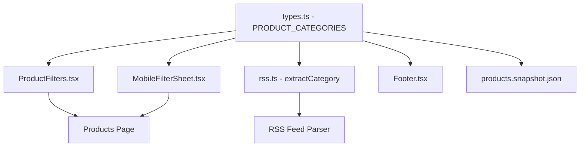

# Design Document: Category Update

## Overview

Dokumen ini menjelaskan desain teknis untuk memperbarui sistem kategori produk di website Tenunan Songket. Perubahan ini melibatkan penggantian kategori demo dengan kategori asli dari website lama berdasarkan data XML.

## Architecture

Sistem kategori terdiri dari beberapa komponen yang saling terhubung:



## Components and Interfaces

### 1. PRODUCT_CATEGORIES Constant (src/lib/types.ts)

Konstanta utama yang mendefinisikan semua kategori valid:

```typescript
export const PRODUCT_CATEGORIES = [
  "Beragi",
  "Arap Gegati",
  "Bertabur",
  "Jongsarat",
  "Si Pugut",
  "Silubang Bangsi",
  "Tajung",
  "Lainnya",
] as const;

export type ProductCategory = (typeof PRODUCT_CATEGORIES)[number];
```

### 2. RSS Category Extraction (src/lib/rss.ts)

Fungsi `extractCategory` akan diperbarui dengan keyword mapping baru:

```typescript
export function extractCategory(title: string, description: string): string {
  const text = `${title} ${description}`.toLowerCase();

  const categoryKeywords: Record<string, string[]> = {
    "Beragi": ["beragi"],
    "Arap Gegati": ["arap", "gegati", "arapgegati"],
    "Bertabur": ["bertabur", "tabur", "betabur"],
    "Jongsarat": ["jongsarat", "jong sarat"],
    "Si Pugut": ["sipugut", "si pugut", "pugut"],
    "Silubang Bangsi": ["silubang", "bangsi", "silubangbangsi"],
    "Tajung": ["tajung"],
  };

  for (const [category, keywords] of Object.entries(categoryKeywords)) {
    if (keywords.some((keyword) => text.includes(keyword))) {
      return category;
    }
  }

  return "Lainnya";
}
```

### 3. Footer Navigation (src/components/layout/Footer.tsx)

Link navigasi footer akan diperbarui:

```typescript
const footerLinks = {
  shop: [
    { name: "Semua Produk", href: "/products" },
    { name: "Beragi", href: "/products?category=Beragi" },
    { name: "Arap Gegati", href: "/products?category=Arap%20Gegati" },
    { name: "Bertabur", href: "/products?category=Bertabur" },
  ],
  // ...
};
```

### 4. Product Snapshot Data (src/data/products.snapshot.json)

Kategori produk dalam snapshot akan diperbarui berdasarkan konten produk:

| Produk | Kategori Lama | Kategori Baru |
|--------|---------------|---------------|
| Beli Kain Tenunan Brunei | Kain Tenun | Lainnya |
| Mubarak Fest 2024 | Kain Tenun | Lainnya |
| Tenunan Songket SSWF | Songket Brunei | Lainnya |
| Motif Bercelaru | Songket Brunei | Si Pugut |
| Pakaian Tradisional | Songket Brunei | Lainnya |
| Kain Sukmaindera | Songket Brunei | Lainnya |
| Kain Sipugut | Songket Brunei | Si Pugut |
| Selendang Songket | Aksesoris | Lainnya |

## Data Models

Tidak ada perubahan pada struktur data model. Hanya nilai kategori yang berubah.

```typescript
// Existing Product type - no changes needed
export type Product = {
  id: string;
  slug: string;
  title: string;
  description: string;
  image?: string;
  price: number;
  currency: "IDR";
  category: string; // Will now use new categories
  tags: string[];
  inStock: boolean;
  rating: number;
  sold: number;
  createdAt?: string;
  sourceUrl: string;
};
```

## Correctness Properties

*A property is a characteristic or behavior that should hold true across all valid executions of a system-essentially, a formal statement about what the system should do. Properties serve as the bridge between human-readable specifications and machine-verifiable correctness guarantees.*

### Property 1: Category List Validity

*For any* reference to PRODUCT_CATEGORIES in the application, the array SHALL contain exactly 8 elements: "Beragi", "Arap Gegati", "Bertabur", "Jongsarat", "Si Pugut", "Silubang Bangsi", "Tajung", and "Lainnya", and SHALL NOT contain any old demo categories.

**Validates: Requirements 1.1, 1.3**

### Property 2: Keyword-to-Category Mapping

*For any* product title and description containing a category keyword, the `extractCategory` function SHALL return the corresponding category. Specifically:
- Text containing "beragi" → "Beragi"
- Text containing "arap" or "gegati" → "Arap Gegati"
- Text containing "bertabur" or "tabur" or "betabur" → "Bertabur"
- Text containing "jongsarat" → "Jongsarat"
- Text containing "sipugut" or "pugut" → "Si Pugut"
- Text containing "silubang" or "bangsi" → "Silubang Bangsi"
- Text containing "tajung" → "Tajung"

**Validates: Requirements 2.1, 2.2**

### Property 3: Default Category Fallback

*For any* product title and description that does NOT contain any category keywords, the `extractCategory` function SHALL return "Lainnya".

**Validates: Requirements 2.3**

### Property 4: Filter Category Consistency

*For any* product list and selected category filter, the filtered results SHALL only contain products whose category matches the selected filter.

**Validates: Requirements 1.2, 4.2, 5.2**

## Error Handling

1. **Invalid Category**: Jika produk memiliki kategori yang tidak valid, sistem akan menampilkan "Lainnya" sebagai fallback
2. **Missing Keywords**: Jika tidak ada keyword yang cocok, kategori default "Lainnya" akan digunakan
3. **Empty Category**: Jika kategori kosong, sistem akan menggunakan "Lainnya"

## Testing Strategy

### Unit Tests

1. **Category Constant Test**: Verifikasi PRODUCT_CATEGORIES berisi kategori yang benar
2. **Footer Links Test**: Verifikasi link footer menggunakan kategori baru
3. **Snapshot Data Test**: Verifikasi semua produk dalam snapshot memiliki kategori valid

### Property-Based Tests

1. **Keyword Mapping Property Test**: 
   - Generate random strings containing category keywords
   - Verify extractCategory returns correct category
   - Minimum 100 iterations

2. **Default Category Property Test**:
   - Generate random strings without any keywords
   - Verify extractCategory returns "Lainnya"
   - Minimum 100 iterations

3. **Filter Consistency Property Test**:
   - Generate random product lists with various categories
   - Apply category filter
   - Verify all results have matching category
   - Minimum 100 iterations

### Testing Framework

- **Framework**: Vitest
- **Property Testing Library**: fast-check
- **Test Location**: `src/__tests__/property/category.property.test.ts`
