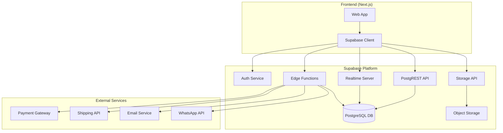
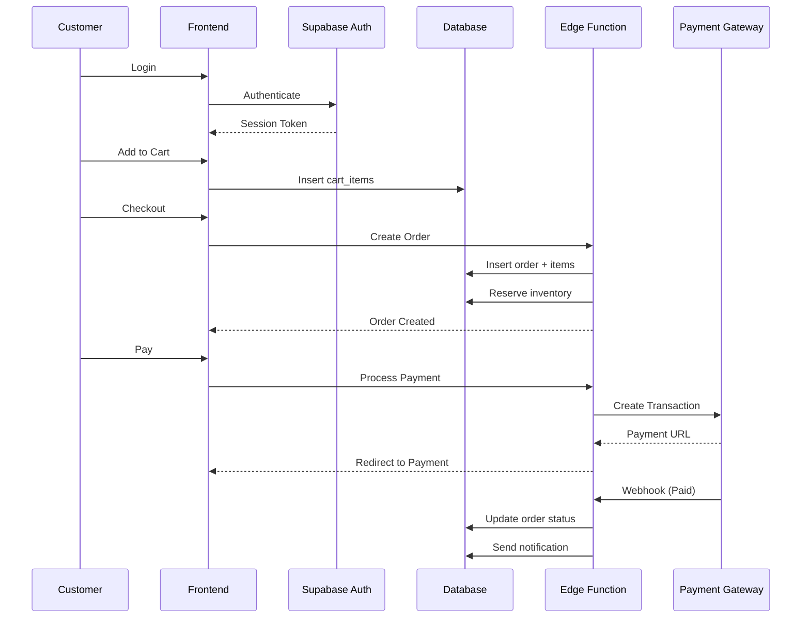

# Design Document: Supabase Backend E-Commerce

## Overview

Sistem backend e-commerce untuk Tenunan Songket menggunakan Supabase sebagai platform utama. Arsitektur ini memanfaatkan PostgreSQL database dengan Row Level Security (RLS), Supabase Auth untuk autentikasi, Supabase Storage untuk file management, dan Supabase Realtime untuk live updates.

### Tech Stack
- **Database**: PostgreSQL (via Supabase)
- **Authentication**: Supabase Auth (email, OAuth)
- **Storage**: Supabase Storage
- **Realtime**: Supabase Realtime Subscriptions
- **Edge Functions**: Deno-based serverless functions
- **Frontend Integration**: @supabase/supabase-js client

---

## Architecture



### System Flow



---

## Components and Interfaces

### 1. Authentication Module

```typescript
// lib/supabase/auth.ts
interface AuthService {
  signUp(email: string, password: string, metadata: UserMetadata): Promise<AuthResponse>
  signIn(email: string, password: string): Promise<AuthResponse>
  signInWithGoogle(): Promise<AuthResponse>
  signOut(): Promise<void>
  resetPassword(email: string): Promise<void>
  updatePassword(newPassword: string): Promise<void>
  getSession(): Promise<Session | null>
  getUser(): Promise<User | null>
}

interface UserMetadata {
  full_name: string
  phone?: string
  avatar_url?: string
}
```

### 2. Product Service

```typescript
// lib/supabase/products.ts
interface ProductService {
  getProducts(filters: ProductFilters): Promise<PaginatedResponse<Product>>
  getProductBySlug(slug: string): Promise<Product | null>
  getProductsByCategory(categorySlug: string): Promise<Product[]>
  searchProducts(query: string): Promise<Product[]>
  
  // Admin only
  createProduct(data: CreateProductInput): Promise<Product>
  updateProduct(id: string, data: UpdateProductInput): Promise<Product>
  deleteProduct(id: string): Promise<void>
  updateStock(id: string, quantity: number, reason: string): Promise<void>
}

interface ProductFilters {
  category?: string
  minPrice?: number
  maxPrice?: number
  inStock?: boolean
  sortBy?: 'price' | 'created_at' | 'sold' | 'rating'
  sortOrder?: 'asc' | 'desc'
  page?: number
  limit?: number
}
```

### 3. Cart Service

```typescript
// lib/supabase/cart.ts
interface CartService {
  getCart(): Promise<CartWithItems>
  addItem(productId: string, quantity: number): Promise<CartItem>
  updateQuantity(itemId: string, quantity: number): Promise<CartItem>
  removeItem(itemId: string): Promise<void>
  clearCart(): Promise<void>
  applyCoupon(code: string): Promise<CouponValidation>
  removeCoupon(): Promise<void>
  getCartSummary(): Promise<CartSummary>
}

interface CartSummary {
  subtotal: number
  discount: number
  shipping: number
  total: number
  itemCount: number
}
```

### 4. Order Service

```typescript
// lib/supabase/orders.ts
interface OrderService {
  createOrder(data: CreateOrderInput): Promise<Order>
  getOrders(filters?: OrderFilters): Promise<PaginatedResponse<Order>>
  getOrderById(id: string): Promise<OrderWithDetails | null>
  getOrderByNumber(orderNumber: string): Promise<OrderWithDetails | null>
  cancelOrder(id: string, reason: string): Promise<Order>
  
  // Admin only
  updateOrderStatus(id: string, status: OrderStatus): Promise<Order>
  getAllOrders(filters?: AdminOrderFilters): Promise<PaginatedResponse<Order>>
}

type OrderStatus = 
  | 'pending_payment'
  | 'paid'
  | 'processing'
  | 'shipped'
  | 'delivered'
  | 'completed'
  | 'cancelled'
  | 'refunded'
```

### 5. Payment Service (International)

```typescript
// lib/supabase/payments.ts
interface PaymentService {
  createPayment(orderId: string, method: PaymentMethod, currency: Currency): Promise<PaymentIntent>
  createStripeCheckout(orderId: string, currency: Currency): Promise<StripeCheckoutSession>
  createPayPalOrder(orderId: string, currency: Currency): Promise<PayPalOrder>
  getPaymentStatus(paymentId: string): Promise<Payment>
  processRefund(paymentId: string, amount?: number): Promise<Refund>
  
  // Webhook handlers
  handleStripeWebhook(payload: StripeWebhookPayload): Promise<void>
  handlePayPalWebhook(payload: PayPalWebhookPayload): Promise<void>
}

type PaymentMethod = 
  | 'stripe_card'      // Credit/Debit Card via Stripe
  | 'stripe_alipay'    // Alipay via Stripe
  | 'paypal'           // PayPal
  | 'bank_transfer'    // International Wire Transfer

type Currency = 'USD' | 'MYR' | 'SGD' | 'BND' | 'EUR' | 'GBP' | 'IDR'

interface PaymentIntent {
  id: string
  clientSecret?: string  // For Stripe
  checkoutUrl?: string   // For PayPal/redirect
  amount: number
  currency: Currency
  expiresAt: Date
}
```

### 6. Shipping Service (International)

```typescript
// lib/supabase/shipping.ts
interface ShippingService {
  getShippingZones(): Promise<ShippingZone[]>
  getCountries(): Promise<Country[]>
  calculateShipping(destination: InternationalAddress, weight: number, dimensions: Dimensions): Promise<ShippingOption[]>
  getTrackingInfo(trackingNumber: string, courier: InternationalCourier): Promise<TrackingInfo>
  
  // Admin only
  updateTracking(orderId: string, trackingNumber: string): Promise<Shipping>
  createShippingLabel(orderId: string, courier: InternationalCourier): Promise<ShippingLabel>
}

type InternationalCourier = 'dhl' | 'fedex' | 'ups' | 'ems' | 'pos_international'

interface ShippingZone {
  id: string
  name: string
  countries: string[]  // ISO country codes
  baseRate: number
  perKgRate: number
  estimatedDays: string
}

interface InternationalAddress {
  recipientName: string
  phone: string
  addressLine1: string
  addressLine2?: string
  city: string
  state: string
  postalCode: string
  country: string  // ISO country code
}

interface ShippingOption {
  courier: InternationalCourier
  service: string
  cost: number
  currency: Currency
  estimatedDays: string
  includesInsurance: boolean
  trackingAvailable: boolean
}

interface Dimensions {
  length: number  // cm
  width: number   // cm
  height: number  // cm
}
```

---

## Data Models

### Database Schema

```mermaid
erDiagram
    users ||--o{ profiles : has
    users ||--o{ addresses : has
    users ||--o{ carts : has
    users ||--o{ orders : places
    users ||--o{ reviews : writes
    users ||--o{ wishlists : has
    users ||--o{ notifications : receives
    
    categories ||--o{ products : contains
    categories ||--o{ categories : parent
    
    products ||--o{ product_images : has
    products ||--o{ cart_items : in
    products ||--o{ order_items : in
    products ||--o{ reviews : has
    products ||--o{ wishlists : in
    products ||--o{ inventory_logs : tracks
    
    carts ||--o{ cart_items : contains
    
    orders ||--o{ order_items : contains
    orders ||--|| payments : has
    orders ||--|| shippings : has
    orders ||--o| coupons : uses
    
    coupons ||--o{ coupon_usages : tracks

    users {
        uuid id PK
        string email
        timestamp created_at
    }
    
    profiles {
        uuid id PK
        uuid user_id FK
        string full_name
        string phone
        string avatar_url
        jsonb preferences
        timestamp created_at
        timestamp updated_at
    }
    
    addresses {
        uuid id PK
        uuid user_id FK
        string label
        string recipient_name
        string phone
        string province
        string city
        string district
        string postal_code
        text full_address
        boolean is_default
        boolean is_deleted
        timestamp created_at
    }
    
    categories {
        uuid id PK
        uuid parent_id FK
        string name
        string slug UK
        text description
        string image_url
        int display_order
        boolean is_active
        timestamp created_at
    }
    
    products {
        uuid id PK
        uuid category_id FK
        string slug UK
        string title
        text description
        decimal price
        decimal sale_price
        int stock
        int reserved_stock
        int sold
        decimal weight
        jsonb dimensions
        decimal average_rating
        int review_count
        boolean is_active
        boolean is_deleted
        string meta_title
        text meta_description
        timestamp created_at
        timestamp updated_at
    }
    
    product_images {
        uuid id PK
        uuid product_id FK
        string url
        int display_order
        boolean is_primary
        timestamp created_at
    }
    
    carts {
        uuid id PK
        uuid user_id FK
        uuid coupon_id FK
        timestamp expires_at
        timestamp created_at
        timestamp updated_at
    }
    
    cart_items {
        uuid id PK
        uuid cart_id FK
        uuid product_id FK
        int quantity
        timestamp created_at
        timestamp updated_at
    }
    
    orders {
        uuid id PK
        uuid user_id FK
        uuid coupon_id FK
        string order_number UK
        string status
        decimal subtotal
        decimal discount
        decimal shipping_cost
        decimal total
        jsonb shipping_address
        text notes
        timestamp paid_at
        timestamp shipped_at
        timestamp delivered_at
        timestamp completed_at
        timestamp cancelled_at
        text cancel_reason
        timestamp created_at
        timestamp updated_at
    }
    
    order_items {
        uuid id PK
        uuid order_id FK
        uuid product_id FK
        string product_title
        string product_image
        decimal price
        int quantity
        decimal subtotal
        timestamp created_at
    }
    
    payments {
        uuid id PK
        uuid order_id FK
        string method
        decimal amount
        string status
        string transaction_id
        string virtual_account
        string payment_proof_url
        jsonb payment_data
        timestamp expires_at
        timestamp paid_at
        timestamp created_at
        timestamp updated_at
    }
    
    shippings {
        uuid id PK
        uuid order_id FK
        string courier
        string service
        string tracking_number
        decimal cost
        string estimated_days
        jsonb tracking_history
        timestamp shipped_at
        timestamp delivered_at
        timestamp created_at
        timestamp updated_at
    }
    
    reviews {
        uuid id PK
        uuid product_id FK
        uuid user_id FK
        uuid order_id FK
        int rating
        text review_text
        jsonb images
        int helpful_count
        boolean is_published
        timestamp created_at
        timestamp updated_at
    }
    
    wishlists {
        uuid id PK
        uuid user_id FK
        uuid product_id FK
        timestamp created_at
    }
    
    coupons {
        uuid id PK
        string code UK
        string type
        decimal value
        decimal min_purchase
        decimal max_discount
        uuid category_id FK
        int usage_limit
        int used_count
        timestamp start_date
        timestamp end_date
        boolean is_active
        timestamp created_at
    }
    
    coupon_usages {
        uuid id PK
        uuid coupon_id FK
        uuid user_id FK
        uuid order_id FK
        timestamp created_at
    }
    
    notifications {
        uuid id PK
        uuid user_id FK
        string type
        string title
        text message
        jsonb data
        boolean is_read
        timestamp created_at
    }
    
    inventory_logs {
        uuid id PK
        uuid product_id FK
        uuid user_id FK
        int quantity_change
        int stock_before
        int stock_after
        string reason
        uuid reference_id
        string reference_type
        timestamp created_at
    }
    
    audit_logs {
        uuid id PK
        uuid user_id FK
        string action
        string table_name
        uuid record_id
        jsonb old_data
        jsonb new_data
        string ip_address
        timestamp created_at
    }
```



### SQL Schema Definitions

```sql
-- Enable UUID extension
CREATE EXTENSION IF NOT EXISTS "uuid-ossp";

-- Profiles table (extends auth.users)
CREATE TABLE profiles (
    id UUID PRIMARY KEY DEFAULT uuid_generate_v4(),
    user_id UUID REFERENCES auth.users(id) ON DELETE CASCADE UNIQUE NOT NULL,
    full_name VARCHAR(255),
    phone VARCHAR(20),
    avatar_url TEXT,
    role VARCHAR(20) DEFAULT 'customer' CHECK (role IN ('customer', 'admin')),
    preferences JSONB DEFAULT '{"notifications": {"email": true, "whatsapp": true, "push": true}}',
    created_at TIMESTAMPTZ DEFAULT NOW(),
    updated_at TIMESTAMPTZ DEFAULT NOW()
);

-- Addresses table (International format)
CREATE TABLE addresses (
    id UUID PRIMARY KEY DEFAULT uuid_generate_v4(),
    user_id UUID REFERENCES auth.users(id) ON DELETE CASCADE NOT NULL,
    label VARCHAR(50) DEFAULT 'Home',
    recipient_name VARCHAR(255) NOT NULL,
    phone VARCHAR(30) NOT NULL,
    address_line1 VARCHAR(255) NOT NULL,
    address_line2 VARCHAR(255),
    city VARCHAR(100) NOT NULL,
    state VARCHAR(100) NOT NULL,
    postal_code VARCHAR(20) NOT NULL,
    country VARCHAR(2) NOT NULL,  -- ISO 3166-1 alpha-2 code
    is_default BOOLEAN DEFAULT FALSE,
    is_deleted BOOLEAN DEFAULT FALSE,
    created_at TIMESTAMPTZ DEFAULT NOW()
);

-- Countries table
CREATE TABLE countries (
    code VARCHAR(2) PRIMARY KEY,  -- ISO 3166-1 alpha-2
    name VARCHAR(100) NOT NULL,
    currency VARCHAR(3) NOT NULL,  -- ISO 4217
    phone_code VARCHAR(10),
    is_shipping_enabled BOOLEAN DEFAULT TRUE,
    created_at TIMESTAMPTZ DEFAULT NOW()
);

-- Shipping zones table
CREATE TABLE shipping_zones (
    id UUID PRIMARY KEY DEFAULT uuid_generate_v4(),
    name VARCHAR(100) NOT NULL,
    base_rate DECIMAL(15,2) NOT NULL,
    per_kg_rate DECIMAL(15,2) NOT NULL,
    currency VARCHAR(3) DEFAULT 'USD',
    estimated_days VARCHAR(20),
    is_active BOOLEAN DEFAULT TRUE,
    created_at TIMESTAMPTZ DEFAULT NOW()
);

-- Shipping zone countries (many-to-many)
CREATE TABLE shipping_zone_countries (
    zone_id UUID REFERENCES shipping_zones(id) ON DELETE CASCADE,
    country_code VARCHAR(2) REFERENCES countries(code) ON DELETE CASCADE,
    PRIMARY KEY (zone_id, country_code)
);

-- Categories table
CREATE TABLE categories (
    id UUID PRIMARY KEY DEFAULT uuid_generate_v4(),
    parent_id UUID REFERENCES categories(id) ON DELETE SET NULL,
    name VARCHAR(100) NOT NULL,
    slug VARCHAR(100) UNIQUE NOT NULL,
    description TEXT,
    image_url TEXT,
    display_order INT DEFAULT 0,
    is_active BOOLEAN DEFAULT TRUE,
    created_at TIMESTAMPTZ DEFAULT NOW()
);

-- Products table
CREATE TABLE products (
    id UUID PRIMARY KEY DEFAULT uuid_generate_v4(),
    category_id UUID REFERENCES categories(id) ON DELETE SET NULL,
    slug VARCHAR(255) UNIQUE NOT NULL,
    title VARCHAR(255) NOT NULL,
    description TEXT,
    price DECIMAL(15,2) NOT NULL CHECK (price >= 0),
    sale_price DECIMAL(15,2) CHECK (sale_price >= 0),
    stock INT DEFAULT 0 CHECK (stock >= 0),
    reserved_stock INT DEFAULT 0 CHECK (reserved_stock >= 0),
    sold INT DEFAULT 0 CHECK (sold >= 0),
    weight DECIMAL(10,2) DEFAULT 0,
    dimensions JSONB DEFAULT '{"length": 0, "width": 0, "height": 0}',
    average_rating DECIMAL(3,2) DEFAULT 0 CHECK (average_rating >= 0 AND average_rating <= 5),
    review_count INT DEFAULT 0,
    is_active BOOLEAN DEFAULT TRUE,
    is_deleted BOOLEAN DEFAULT FALSE,
    meta_title VARCHAR(255),
    meta_description TEXT,
    source_url TEXT,
    created_at TIMESTAMPTZ DEFAULT NOW(),
    updated_at TIMESTAMPTZ DEFAULT NOW()
);

-- Product images table
CREATE TABLE product_images (
    id UUID PRIMARY KEY DEFAULT uuid_generate_v4(),
    product_id UUID REFERENCES products(id) ON DELETE CASCADE NOT NULL,
    url TEXT NOT NULL,
    display_order INT DEFAULT 0,
    is_primary BOOLEAN DEFAULT FALSE,
    created_at TIMESTAMPTZ DEFAULT NOW()
);

-- Carts table
CREATE TABLE carts (
    id UUID PRIMARY KEY DEFAULT uuid_generate_v4(),
    user_id UUID REFERENCES auth.users(id) ON DELETE CASCADE UNIQUE NOT NULL,
    coupon_id UUID REFERENCES coupons(id) ON DELETE SET NULL,
    expires_at TIMESTAMPTZ DEFAULT (NOW() + INTERVAL '7 days'),
    created_at TIMESTAMPTZ DEFAULT NOW(),
    updated_at TIMESTAMPTZ DEFAULT NOW()
);

-- Cart items table
CREATE TABLE cart_items (
    id UUID PRIMARY KEY DEFAULT uuid_generate_v4(),
    cart_id UUID REFERENCES carts(id) ON DELETE CASCADE NOT NULL,
    product_id UUID REFERENCES products(id) ON DELETE CASCADE NOT NULL,
    quantity INT NOT NULL CHECK (quantity > 0),
    created_at TIMESTAMPTZ DEFAULT NOW(),
    updated_at TIMESTAMPTZ DEFAULT NOW(),
    UNIQUE(cart_id, product_id)
);

-- Coupons table
CREATE TABLE coupons (
    id UUID PRIMARY KEY DEFAULT uuid_generate_v4(),
    code VARCHAR(50) UNIQUE NOT NULL,
    type VARCHAR(20) NOT NULL CHECK (type IN ('percentage', 'fixed')),
    value DECIMAL(15,2) NOT NULL CHECK (value > 0),
    min_purchase DECIMAL(15,2) DEFAULT 0,
    max_discount DECIMAL(15,2),
    category_id UUID REFERENCES categories(id) ON DELETE SET NULL,
    usage_limit INT,
    used_count INT DEFAULT 0,
    start_date TIMESTAMPTZ NOT NULL,
    end_date TIMESTAMPTZ NOT NULL,
    is_active BOOLEAN DEFAULT TRUE,
    created_at TIMESTAMPTZ DEFAULT NOW()
);

-- Orders table (International)
CREATE TABLE orders (
    id UUID PRIMARY KEY DEFAULT uuid_generate_v4(),
    user_id UUID REFERENCES auth.users(id) ON DELETE SET NULL NOT NULL,
    coupon_id UUID REFERENCES coupons(id) ON DELETE SET NULL,
    order_number VARCHAR(20) UNIQUE NOT NULL,
    status VARCHAR(20) DEFAULT 'pending_payment' CHECK (status IN (
        'pending_payment', 'paid', 'processing', 'shipped', 
        'delivered', 'completed', 'cancelled', 'refunded'
    )),
    subtotal DECIMAL(15,2) NOT NULL,
    discount DECIMAL(15,2) DEFAULT 0,
    shipping_cost DECIMAL(15,2) DEFAULT 0,
    insurance_cost DECIMAL(15,2) DEFAULT 0,
    total DECIMAL(15,2) NOT NULL,
    currency VARCHAR(3) NOT NULL DEFAULT 'USD',
    exchange_rate DECIMAL(15,6) DEFAULT 1,
    total_idr DECIMAL(15,2),  -- For reporting
    shipping_address JSONB NOT NULL,  -- International format snapshot
    billing_address JSONB,
    notes TEXT,
    paid_at TIMESTAMPTZ,
    shipped_at TIMESTAMPTZ,
    delivered_at TIMESTAMPTZ,
    completed_at TIMESTAMPTZ,
    cancelled_at TIMESTAMPTZ,
    cancel_reason TEXT,
    created_at TIMESTAMPTZ DEFAULT NOW(),
    updated_at TIMESTAMPTZ DEFAULT NOW()
);

-- Order items table
CREATE TABLE order_items (
    id UUID PRIMARY KEY DEFAULT uuid_generate_v4(),
    order_id UUID REFERENCES orders(id) ON DELETE CASCADE NOT NULL,
    product_id UUID REFERENCES products(id) ON DELETE SET NULL NOT NULL,
    product_title VARCHAR(255) NOT NULL,
    product_image TEXT,
    price DECIMAL(15,2) NOT NULL,
    quantity INT NOT NULL CHECK (quantity > 0),
    subtotal DECIMAL(15,2) NOT NULL,
    created_at TIMESTAMPTZ DEFAULT NOW()
);

-- Payments table (International)
CREATE TABLE payments (
    id UUID PRIMARY KEY DEFAULT uuid_generate_v4(),
    order_id UUID REFERENCES orders(id) ON DELETE CASCADE UNIQUE NOT NULL,
    method VARCHAR(50) NOT NULL,
    gateway VARCHAR(20) NOT NULL CHECK (gateway IN ('stripe', 'paypal', 'manual')),
    amount DECIMAL(15,2) NOT NULL,
    currency VARCHAR(3) NOT NULL DEFAULT 'USD',
    exchange_rate DECIMAL(15,6) DEFAULT 1,  -- Rate to IDR at time of payment
    amount_idr DECIMAL(15,2),  -- Amount in IDR for reporting
    status VARCHAR(20) DEFAULT 'pending' CHECK (status IN (
        'pending', 'processing', 'paid', 'failed', 'expired', 'refunded', 'partially_refunded'
    )),
    gateway_transaction_id VARCHAR(100),
    gateway_checkout_id VARCHAR(100),
    gateway_payment_intent_id VARCHAR(100),
    gateway_response JSONB,
    refund_amount DECIMAL(15,2) DEFAULT 0,
    refund_reason TEXT,
    expires_at TIMESTAMPTZ,
    paid_at TIMESTAMPTZ,
    refunded_at TIMESTAMPTZ,
    created_at TIMESTAMPTZ DEFAULT NOW(),
    updated_at TIMESTAMPTZ DEFAULT NOW()
);

-- Shippings table (International)
CREATE TABLE shippings (
    id UUID PRIMARY KEY DEFAULT uuid_generate_v4(),
    order_id UUID REFERENCES orders(id) ON DELETE CASCADE UNIQUE NOT NULL,
    courier VARCHAR(50) NOT NULL,
    service VARCHAR(50) NOT NULL,
    tracking_number VARCHAR(100),
    cost DECIMAL(15,2) NOT NULL,
    currency VARCHAR(3) NOT NULL DEFAULT 'USD',
    insurance_cost DECIMAL(15,2) DEFAULT 0,
    estimated_days VARCHAR(20),
    weight_kg DECIMAL(10,3),
    dimensions JSONB,  -- {length, width, height in cm}
    customs_value DECIMAL(15,2),
    customs_description TEXT,
    tracking_history JSONB DEFAULT '[]',
    label_url TEXT,
    shipped_at TIMESTAMPTZ,
    delivered_at TIMESTAMPTZ,
    created_at TIMESTAMPTZ DEFAULT NOW(),
    updated_at TIMESTAMPTZ DEFAULT NOW()
);

-- Reviews table
CREATE TABLE reviews (
    id UUID PRIMARY KEY DEFAULT uuid_generate_v4(),
    product_id UUID REFERENCES products(id) ON DELETE CASCADE NOT NULL,
    user_id UUID REFERENCES auth.users(id) ON DELETE SET NULL NOT NULL,
    order_id UUID REFERENCES orders(id) ON DELETE SET NULL,
    rating INT NOT NULL CHECK (rating >= 1 AND rating <= 5),
    review_text TEXT,
    images JSONB DEFAULT '[]',
    helpful_count INT DEFAULT 0,
    is_published BOOLEAN DEFAULT FALSE,
    created_at TIMESTAMPTZ DEFAULT NOW(),
    updated_at TIMESTAMPTZ DEFAULT NOW(),
    UNIQUE(order_id, product_id)
);

-- Wishlists table
CREATE TABLE wishlists (
    id UUID PRIMARY KEY DEFAULT uuid_generate_v4(),
    user_id UUID REFERENCES auth.users(id) ON DELETE CASCADE NOT NULL,
    product_id UUID REFERENCES products(id) ON DELETE CASCADE NOT NULL,
    created_at TIMESTAMPTZ DEFAULT NOW(),
    UNIQUE(user_id, product_id)
);

-- Coupon usages table
CREATE TABLE coupon_usages (
    id UUID PRIMARY KEY DEFAULT uuid_generate_v4(),
    coupon_id UUID REFERENCES coupons(id) ON DELETE CASCADE NOT NULL,
    user_id UUID REFERENCES auth.users(id) ON DELETE CASCADE NOT NULL,
    order_id UUID REFERENCES orders(id) ON DELETE SET NULL,
    created_at TIMESTAMPTZ DEFAULT NOW()
);

-- Notifications table
CREATE TABLE notifications (
    id UUID PRIMARY KEY DEFAULT uuid_generate_v4(),
    user_id UUID REFERENCES auth.users(id) ON DELETE CASCADE NOT NULL,
    type VARCHAR(50) NOT NULL,
    title VARCHAR(255) NOT NULL,
    message TEXT NOT NULL,
    data JSONB,
    is_read BOOLEAN DEFAULT FALSE,
    created_at TIMESTAMPTZ DEFAULT NOW()
);

-- Inventory logs table
CREATE TABLE inventory_logs (
    id UUID PRIMARY KEY DEFAULT uuid_generate_v4(),
    product_id UUID REFERENCES products(id) ON DELETE CASCADE NOT NULL,
    user_id UUID REFERENCES auth.users(id) ON DELETE SET NULL,
    quantity_change INT NOT NULL,
    stock_before INT NOT NULL,
    stock_after INT NOT NULL,
    reason VARCHAR(100) NOT NULL,
    reference_id UUID,
    reference_type VARCHAR(50),
    created_at TIMESTAMPTZ DEFAULT NOW()
);

-- Audit logs table
CREATE TABLE audit_logs (
    id UUID PRIMARY KEY DEFAULT uuid_generate_v4(),
    user_id UUID REFERENCES auth.users(id) ON DELETE SET NULL,
    action VARCHAR(50) NOT NULL,
    table_name VARCHAR(100) NOT NULL,
    record_id UUID,
    old_data JSONB,
    new_data JSONB,
    ip_address INET,
    created_at TIMESTAMPTZ DEFAULT NOW()
);

-- Daily stats table (for analytics)
CREATE TABLE daily_stats (
    id UUID PRIMARY KEY DEFAULT uuid_generate_v4(),
    date DATE UNIQUE NOT NULL,
    total_orders INT DEFAULT 0,
    total_revenue DECIMAL(15,2) DEFAULT 0,
    total_customers INT DEFAULT 0,
    total_products_sold INT DEFAULT 0,
    created_at TIMESTAMPTZ DEFAULT NOW(),
    updated_at TIMESTAMPTZ DEFAULT NOW()
);
```


### Indexes for Performance

```sql
-- Products indexes
CREATE INDEX idx_products_category ON products(category_id) WHERE is_deleted = FALSE;
CREATE INDEX idx_products_slug ON products(slug);
CREATE INDEX idx_products_price ON products(price) WHERE is_active = TRUE AND is_deleted = FALSE;
CREATE INDEX idx_products_created ON products(created_at DESC);
CREATE INDEX idx_products_sold ON products(sold DESC) WHERE is_active = TRUE;
CREATE INDEX idx_products_rating ON products(average_rating DESC) WHERE is_active = TRUE;
CREATE INDEX idx_products_search ON products USING gin(to_tsvector('indonesian', title || ' ' || COALESCE(description, '')));

-- Orders indexes
CREATE INDEX idx_orders_user ON orders(user_id);
CREATE INDEX idx_orders_status ON orders(status);
CREATE INDEX idx_orders_created ON orders(created_at DESC);
CREATE INDEX idx_orders_number ON orders(order_number);

-- Cart items indexes
CREATE INDEX idx_cart_items_cart ON cart_items(cart_id);
CREATE INDEX idx_cart_items_product ON cart_items(product_id);

-- Reviews indexes
CREATE INDEX idx_reviews_product ON reviews(product_id) WHERE is_published = TRUE;
CREATE INDEX idx_reviews_user ON reviews(user_id);

-- Notifications indexes
CREATE INDEX idx_notifications_user ON notifications(user_id, is_read, created_at DESC);

-- Inventory logs indexes
CREATE INDEX idx_inventory_logs_product ON inventory_logs(product_id, created_at DESC);
```

### Row Level Security (RLS) Policies

```sql
-- Enable RLS on all tables
ALTER TABLE profiles ENABLE ROW LEVEL SECURITY;
ALTER TABLE addresses ENABLE ROW LEVEL SECURITY;
ALTER TABLE carts ENABLE ROW LEVEL SECURITY;
ALTER TABLE cart_items ENABLE ROW LEVEL SECURITY;
ALTER TABLE orders ENABLE ROW LEVEL SECURITY;
ALTER TABLE order_items ENABLE ROW LEVEL SECURITY;
ALTER TABLE payments ENABLE ROW LEVEL SECURITY;
ALTER TABLE shippings ENABLE ROW LEVEL SECURITY;
ALTER TABLE reviews ENABLE ROW LEVEL SECURITY;
ALTER TABLE wishlists ENABLE ROW LEVEL SECURITY;
ALTER TABLE notifications ENABLE ROW LEVEL SECURITY;

-- Profiles policies
CREATE POLICY "Users can view own profile" ON profiles
    FOR SELECT USING (auth.uid() = user_id);
    
CREATE POLICY "Users can update own profile" ON profiles
    FOR UPDATE USING (auth.uid() = user_id);

-- Addresses policies
CREATE POLICY "Users can view own addresses" ON addresses
    FOR SELECT USING (auth.uid() = user_id AND is_deleted = FALSE);
    
CREATE POLICY "Users can insert own addresses" ON addresses
    FOR INSERT WITH CHECK (auth.uid() = user_id);
    
CREATE POLICY "Users can update own addresses" ON addresses
    FOR UPDATE USING (auth.uid() = user_id);

-- Products policies (public read)
CREATE POLICY "Anyone can view active products" ON products
    FOR SELECT USING (is_active = TRUE AND is_deleted = FALSE);

-- Categories policies (public read)
CREATE POLICY "Anyone can view active categories" ON categories
    FOR SELECT USING (is_active = TRUE);

-- Cart policies
CREATE POLICY "Users can manage own cart" ON carts
    FOR ALL USING (auth.uid() = user_id);

CREATE POLICY "Users can manage own cart items" ON cart_items
    FOR ALL USING (
        cart_id IN (SELECT id FROM carts WHERE user_id = auth.uid())
    );

-- Orders policies
CREATE POLICY "Users can view own orders" ON orders
    FOR SELECT USING (auth.uid() = user_id);
    
CREATE POLICY "Users can create own orders" ON orders
    FOR INSERT WITH CHECK (auth.uid() = user_id);

-- Order items policies
CREATE POLICY "Users can view own order items" ON order_items
    FOR SELECT USING (
        order_id IN (SELECT id FROM orders WHERE user_id = auth.uid())
    );

-- Payments policies
CREATE POLICY "Users can view own payments" ON payments
    FOR SELECT USING (
        order_id IN (SELECT id FROM orders WHERE user_id = auth.uid())
    );

-- Reviews policies
CREATE POLICY "Anyone can view published reviews" ON reviews
    FOR SELECT USING (is_published = TRUE);
    
CREATE POLICY "Users can create own reviews" ON reviews
    FOR INSERT WITH CHECK (auth.uid() = user_id);
    
CREATE POLICY "Users can update own reviews" ON reviews
    FOR UPDATE USING (auth.uid() = user_id);

-- Wishlists policies
CREATE POLICY "Users can manage own wishlist" ON wishlists
    FOR ALL USING (auth.uid() = user_id);

-- Notifications policies
CREATE POLICY "Users can view own notifications" ON notifications
    FOR SELECT USING (auth.uid() = user_id);
    
CREATE POLICY "Users can update own notifications" ON notifications
    FOR UPDATE USING (auth.uid() = user_id);

-- Admin policies (using role from profiles)
CREATE POLICY "Admins can do everything on products" ON products
    FOR ALL USING (
        EXISTS (SELECT 1 FROM profiles WHERE user_id = auth.uid() AND role = 'admin')
    );

CREATE POLICY "Admins can do everything on categories" ON categories
    FOR ALL USING (
        EXISTS (SELECT 1 FROM profiles WHERE user_id = auth.uid() AND role = 'admin')
    );

CREATE POLICY "Admins can view all orders" ON orders
    FOR SELECT USING (
        EXISTS (SELECT 1 FROM profiles WHERE user_id = auth.uid() AND role = 'admin')
    );

CREATE POLICY "Admins can update all orders" ON orders
    FOR UPDATE USING (
        EXISTS (SELECT 1 FROM profiles WHERE user_id = auth.uid() AND role = 'admin')
    );

CREATE POLICY "Admins can manage coupons" ON coupons
    FOR ALL USING (
        EXISTS (SELECT 1 FROM profiles WHERE user_id = auth.uid() AND role = 'admin')
    );
```

### Database Functions & Triggers

```sql
-- Function to generate order number
CREATE OR REPLACE FUNCTION generate_order_number()
RETURNS TEXT AS $$
DECLARE
    today_date TEXT;
    sequence_num INT;
    order_num TEXT;
BEGIN
    today_date := TO_CHAR(NOW(), 'YYYYMMDD');
    
    SELECT COALESCE(MAX(
        CAST(SUBSTRING(order_number FROM 13) AS INT)
    ), 0) + 1
    INTO sequence_num
    FROM orders
    WHERE order_number LIKE 'TS-' || today_date || '-%';
    
    order_num := 'TS-' || today_date || '-' || LPAD(sequence_num::TEXT, 5, '0');
    RETURN order_num;
END;
$$ LANGUAGE plpgsql;

-- Trigger to auto-generate order number
CREATE OR REPLACE FUNCTION set_order_number()
RETURNS TRIGGER AS $$
BEGIN
    IF NEW.order_number IS NULL THEN
        NEW.order_number := generate_order_number();
    END IF;
    RETURN NEW;
END;
$$ LANGUAGE plpgsql;

CREATE TRIGGER trigger_set_order_number
    BEFORE INSERT ON orders
    FOR EACH ROW
    EXECUTE FUNCTION set_order_number();

-- Function to update product rating
CREATE OR REPLACE FUNCTION update_product_rating()
RETURNS TRIGGER AS $$
BEGIN
    UPDATE products
    SET 
        average_rating = (
            SELECT COALESCE(AVG(rating), 0)
            FROM reviews
            WHERE product_id = COALESCE(NEW.product_id, OLD.product_id)
            AND is_published = TRUE
        ),
        review_count = (
            SELECT COUNT(*)
            FROM reviews
            WHERE product_id = COALESCE(NEW.product_id, OLD.product_id)
            AND is_published = TRUE
        ),
        updated_at = NOW()
    WHERE id = COALESCE(NEW.product_id, OLD.product_id);
    
    RETURN COALESCE(NEW, OLD);
END;
$$ LANGUAGE plpgsql;

CREATE TRIGGER trigger_update_product_rating
    AFTER INSERT OR UPDATE OR DELETE ON reviews
    FOR EACH ROW
    EXECUTE FUNCTION update_product_rating();

-- Function to reserve inventory
CREATE OR REPLACE FUNCTION reserve_inventory(
    p_product_id UUID,
    p_quantity INT,
    p_order_id UUID
)
RETURNS BOOLEAN AS $$
DECLARE
    v_available INT;
    v_stock_before INT;
BEGIN
    -- Lock the row
    SELECT stock - reserved_stock, stock
    INTO v_available, v_stock_before
    FROM products
    WHERE id = p_product_id
    FOR UPDATE;
    
    IF v_available < p_quantity THEN
        RETURN FALSE;
    END IF;
    
    -- Reserve stock
    UPDATE products
    SET reserved_stock = reserved_stock + p_quantity,
        updated_at = NOW()
    WHERE id = p_product_id;
    
    -- Log the change
    INSERT INTO inventory_logs (
        product_id, quantity_change, stock_before, stock_after,
        reason, reference_id, reference_type
    ) VALUES (
        p_product_id, -p_quantity, v_stock_before, v_stock_before,
        'order_reserved', p_order_id, 'order'
    );
    
    RETURN TRUE;
END;
$$ LANGUAGE plpgsql;

-- Function to release reserved inventory
CREATE OR REPLACE FUNCTION release_inventory(
    p_product_id UUID,
    p_quantity INT,
    p_order_id UUID
)
RETURNS VOID AS $$
DECLARE
    v_stock_before INT;
BEGIN
    SELECT stock INTO v_stock_before
    FROM products WHERE id = p_product_id;
    
    UPDATE products
    SET reserved_stock = GREATEST(reserved_stock - p_quantity, 0),
        updated_at = NOW()
    WHERE id = p_product_id;
    
    INSERT INTO inventory_logs (
        product_id, quantity_change, stock_before, stock_after,
        reason, reference_id, reference_type
    ) VALUES (
        p_product_id, p_quantity, v_stock_before, v_stock_before,
        'order_cancelled', p_order_id, 'order'
    );
END;
$$ LANGUAGE plpgsql;

-- Function to commit inventory (after order completed)
CREATE OR REPLACE FUNCTION commit_inventory(
    p_product_id UUID,
    p_quantity INT,
    p_order_id UUID
)
RETURNS VOID AS $$
DECLARE
    v_stock_before INT;
BEGIN
    SELECT stock INTO v_stock_before
    FROM products WHERE id = p_product_id;
    
    UPDATE products
    SET 
        stock = stock - p_quantity,
        reserved_stock = GREATEST(reserved_stock - p_quantity, 0),
        sold = sold + p_quantity,
        is_active = CASE WHEN stock - p_quantity <= 0 THEN FALSE ELSE is_active END,
        updated_at = NOW()
    WHERE id = p_product_id;
    
    INSERT INTO inventory_logs (
        product_id, quantity_change, stock_before, stock_after,
        reason, reference_id, reference_type
    ) VALUES (
        p_product_id, -p_quantity, v_stock_before, v_stock_before - p_quantity,
        'order_completed', p_order_id, 'order'
    );
END;
$$ LANGUAGE plpgsql;

-- Function to update timestamps
CREATE OR REPLACE FUNCTION update_updated_at()
RETURNS TRIGGER AS $$
BEGIN
    NEW.updated_at = NOW();
    RETURN NEW;
END;
$$ LANGUAGE plpgsql;

-- Apply updated_at trigger to relevant tables
CREATE TRIGGER trigger_profiles_updated_at
    BEFORE UPDATE ON profiles
    FOR EACH ROW EXECUTE FUNCTION update_updated_at();

CREATE TRIGGER trigger_products_updated_at
    BEFORE UPDATE ON products
    FOR EACH ROW EXECUTE FUNCTION update_updated_at();

CREATE TRIGGER trigger_orders_updated_at
    BEFORE UPDATE ON orders
    FOR EACH ROW EXECUTE FUNCTION update_updated_at();

CREATE TRIGGER trigger_carts_updated_at
    BEFORE UPDATE ON carts
    FOR EACH ROW EXECUTE FUNCTION update_updated_at();

-- Function to create profile on user signup
CREATE OR REPLACE FUNCTION handle_new_user()
RETURNS TRIGGER AS $$
BEGIN
    INSERT INTO profiles (user_id, full_name, avatar_url)
    VALUES (
        NEW.id,
        COALESCE(NEW.raw_user_meta_data->>'full_name', NEW.email),
        NEW.raw_user_meta_data->>'avatar_url'
    );
    RETURN NEW;
END;
$$ LANGUAGE plpgsql SECURITY DEFINER;

CREATE TRIGGER on_auth_user_created
    AFTER INSERT ON auth.users
    FOR EACH ROW EXECUTE FUNCTION handle_new_user();

-- Function to validate coupon
CREATE OR REPLACE FUNCTION validate_coupon(
    p_code TEXT,
    p_user_id UUID,
    p_subtotal DECIMAL,
    p_category_id UUID DEFAULT NULL
)
RETURNS TABLE (
    is_valid BOOLEAN,
    coupon_id UUID,
    discount_amount DECIMAL,
    error_message TEXT
) AS $$
DECLARE
    v_coupon RECORD;
    v_usage_count INT;
    v_discount DECIMAL;
BEGIN
    -- Get coupon
    SELECT * INTO v_coupon
    FROM coupons
    WHERE code = UPPER(p_code)
    AND is_active = TRUE;
    
    IF NOT FOUND THEN
        RETURN QUERY SELECT FALSE, NULL::UUID, 0::DECIMAL, 'Kupon tidak ditemukan';
        RETURN;
    END IF;
    
    -- Check dates
    IF NOW() < v_coupon.start_date THEN
        RETURN QUERY SELECT FALSE, NULL::UUID, 0::DECIMAL, 'Kupon belum aktif';
        RETURN;
    END IF;
    
    IF NOW() > v_coupon.end_date THEN
        RETURN QUERY SELECT FALSE, NULL::UUID, 0::DECIMAL, 'Kupon sudah expired';
        RETURN;
    END IF;
    
    -- Check usage limit
    IF v_coupon.usage_limit IS NOT NULL AND v_coupon.used_count >= v_coupon.usage_limit THEN
        RETURN QUERY SELECT FALSE, NULL::UUID, 0::DECIMAL, 'Kupon sudah habis';
        RETURN;
    END IF;
    
    -- Check if user already used
    SELECT COUNT(*) INTO v_usage_count
    FROM coupon_usages
    WHERE coupon_id = v_coupon.id AND user_id = p_user_id;
    
    IF v_usage_count > 0 THEN
        RETURN QUERY SELECT FALSE, NULL::UUID, 0::DECIMAL, 'Anda sudah pernah menggunakan kupon ini';
        RETURN;
    END IF;
    
    -- Check minimum purchase
    IF p_subtotal < v_coupon.min_purchase THEN
        RETURN QUERY SELECT FALSE, NULL::UUID, 0::DECIMAL, 
            'Minimum pembelian Rp ' || TO_CHAR(v_coupon.min_purchase, 'FM999,999,999');
        RETURN;
    END IF;
    
    -- Check category restriction
    IF v_coupon.category_id IS NOT NULL AND p_category_id IS NOT NULL 
       AND v_coupon.category_id != p_category_id THEN
        RETURN QUERY SELECT FALSE, NULL::UUID, 0::DECIMAL, 'Kupon tidak berlaku untuk kategori ini';
        RETURN;
    END IF;
    
    -- Calculate discount
    IF v_coupon.type = 'percentage' THEN
        v_discount := p_subtotal * (v_coupon.value / 100);
        IF v_coupon.max_discount IS NOT NULL THEN
            v_discount := LEAST(v_discount, v_coupon.max_discount);
        END IF;
    ELSE
        v_discount := v_coupon.value;
    END IF;
    
    RETURN QUERY SELECT TRUE, v_coupon.id, v_discount, NULL::TEXT;
END;
$$ LANGUAGE plpgsql;
```

---

## Correctness Properties

*A property is a characteristic or behavior that should hold true across all valid executions of a system-essentially, a formal statement about what the system should do. Properties serve as the bridge between human-readable specifications and machine-verifiable correctness guarantees.*


### Property 1: User Registration Creates Profile
*For any* valid email and password combination, when a user registers, a corresponding profile record SHALL be created with the same user_id.
**Validates: Requirements 1.1, 1.7**

### Property 2: Authentication Round-Trip
*For any* registered user with valid credentials, logging in and then fetching the session SHALL return the same user data.
**Validates: Requirements 1.3**

### Property 3: Profile Update Persistence
*For any* profile update with valid data, reading the profile after update SHALL return the updated values.
**Validates: Requirements 2.1**

### Property 4: Single Default Address Invariant
*For any* user with multiple addresses, exactly one address SHALL have is_default = true at any time.
**Validates: Requirements 2.2, 2.3**

### Property 5: Product Slug Uniqueness
*For any* two products with different titles, their generated slugs SHALL be unique.
**Validates: Requirements 3.2**

### Property 6: Inventory State Machine Consistency
*For any* product, the following invariant SHALL hold: available_stock = stock - reserved_stock >= 0. Additionally:
- When an order is created, reserved_stock increases by order quantity
- When an order is cancelled, reserved_stock decreases by order quantity
- When an order is completed, both stock and reserved_stock decrease by order quantity
**Validates: Requirements 3.4, 6.5, 14.1, 14.2, 14.3, 14.4**

### Property 7: Stock-Active Invariant
*For any* product where stock - reserved_stock <= 0, the product SHALL have is_active = false.
**Validates: Requirements 3.8**

### Property 8: Category Deletion Protection
*For any* category that has associated products, attempting to delete the category SHALL fail with an error.
**Validates: Requirements 4.4**

### Property 9: Cart Item Idempotence
*For any* product added to cart multiple times, there SHALL be exactly one cart_item record with quantity equal to the sum of all additions.
**Validates: Requirements 5.1, 5.2**

### Property 10: Cart Quantity Stock Validation
*For any* cart item quantity update, if the new quantity exceeds available stock, the update SHALL be rejected.
**Validates: Requirements 5.3**

### Property 11: Cart Total Calculation
*For any* cart with items and optional coupon, total SHALL equal: sum(item.price * item.quantity) - discount_amount.
**Validates: Requirements 5.5**

### Property 12: Order Creation Invariants
*For any* newly created order:
- status SHALL be 'pending_payment'
- order_number SHALL match format TS-YYYYMMDD-XXXXX
- order_items.price SHALL be a snapshot (not affected by subsequent product price changes)
**Validates: Requirements 6.1, 6.2, 6.3**

### Property 13: Review Rating Bounds
*For any* review, rating SHALL be an integer between 1 and 5 inclusive.
**Validates: Requirements 9.2**

### Property 14: Product Rating Calculation
*For any* product with published reviews, average_rating SHALL equal the arithmetic mean of all published review ratings.
**Validates: Requirements 9.3**

### Property 15: Review Uniqueness Per Order Item
*For any* order_id and product_id combination, there SHALL be at most one review record.
**Validates: Requirements 9.4**

### Property 16: Wishlist Uniqueness
*For any* user_id and product_id combination, there SHALL be at most one wishlist record.
**Validates: Requirements 10.3**

### Property 17: Coupon Validation Rules
*For any* coupon application:
- If coupon is expired (now > end_date), validation SHALL fail
- If coupon usage_limit is reached, validation SHALL fail
- If user has already used the coupon, validation SHALL fail
- If subtotal < min_purchase, validation SHALL fail
**Validates: Requirements 11.3, 11.4**

### Property 18: RLS Data Isolation
*For any* authenticated user querying user-specific tables (orders, addresses, cart, wishlist), the result SHALL only contain records where user_id matches the authenticated user's id.
**Validates: Requirements 16.2**

### Property 19: Migration Data Integrity
*For any* product migrated from the source JSON, all fields (slug, title, description, price, images, gallery) SHALL match the source data exactly.
**Validates: Requirements 19.3**

---

## Error Handling

### Error Response Format

```typescript
interface ApiError {
  code: string
  message: string
  details?: Record<string, unknown>
  timestamp: string
}

// Error codes
const ERROR_CODES = {
  // Auth errors
  AUTH_INVALID_CREDENTIALS: 'auth/invalid-credentials',
  AUTH_EMAIL_NOT_VERIFIED: 'auth/email-not-verified',
  AUTH_SESSION_EXPIRED: 'auth/session-expired',
  AUTH_UNAUTHORIZED: 'auth/unauthorized',
  
  // Validation errors
  VALIDATION_FAILED: 'validation/failed',
  VALIDATION_REQUIRED_FIELD: 'validation/required-field',
  VALIDATION_INVALID_FORMAT: 'validation/invalid-format',
  
  // Resource errors
  RESOURCE_NOT_FOUND: 'resource/not-found',
  RESOURCE_ALREADY_EXISTS: 'resource/already-exists',
  RESOURCE_CONFLICT: 'resource/conflict',
  
  // Business logic errors
  CART_EMPTY: 'cart/empty',
  CART_ITEM_OUT_OF_STOCK: 'cart/item-out-of-stock',
  CART_QUANTITY_EXCEEDS_STOCK: 'cart/quantity-exceeds-stock',
  
  ORDER_ALREADY_PAID: 'order/already-paid',
  ORDER_CANNOT_CANCEL: 'order/cannot-cancel',
  ORDER_PAYMENT_EXPIRED: 'order/payment-expired',
  
  COUPON_INVALID: 'coupon/invalid',
  COUPON_EXPIRED: 'coupon/expired',
  COUPON_ALREADY_USED: 'coupon/already-used',
  COUPON_MIN_PURCHASE: 'coupon/min-purchase-not-met',
  
  PAYMENT_FAILED: 'payment/failed',
  PAYMENT_VERIFICATION_FAILED: 'payment/verification-failed',
  
  // System errors
  INTERNAL_ERROR: 'system/internal-error',
  SERVICE_UNAVAILABLE: 'system/service-unavailable',
  RATE_LIMITED: 'system/rate-limited',
}
```

### Error Handling Strategy

1. **Database Errors**: Caught at service layer, transformed to user-friendly messages
2. **Validation Errors**: Return 400 with specific field errors
3. **Auth Errors**: Return 401/403 with appropriate code
4. **Not Found**: Return 404 with resource type
5. **Business Logic Errors**: Return 422 with specific error code
6. **Server Errors**: Log full error, return generic 500 message

---

## Testing Strategy

### Unit Tests
- Test individual service functions with mocked Supabase client
- Test validation functions
- Test utility functions (slug generation, price calculation)
- Test error handling

### Property-Based Tests
- Use fast-check library for TypeScript
- Minimum 100 iterations per property
- Test data generators for:
  - Valid user data
  - Valid product data
  - Valid order data
  - Valid coupon data

### Integration Tests
- Test against real Supabase instance (test project)
- Test RLS policies
- Test database triggers and functions
- Test Edge Functions

### Test Configuration

```typescript
// vitest.config.ts
import { defineConfig } from 'vitest/config'

export default defineConfig({
  test: {
    globals: true,
    environment: 'node',
    setupFiles: ['./src/test/setup.ts'],
    include: ['src/**/*.test.ts', 'src/**/*.property.test.ts'],
    coverage: {
      provider: 'v8',
      reporter: ['text', 'json', 'html'],
    },
  },
})
```

### Property Test Example

```typescript
// src/__tests__/property/inventory.property.test.ts
import { fc } from '@fast-check/vitest'
import { describe, it, expect } from 'vitest'

describe('Inventory State Machine', () => {
  // Feature: supabase-backend, Property 6: Inventory State Machine Consistency
  it.prop([
    fc.integer({ min: 0, max: 1000 }), // initial stock
    fc.array(fc.record({
      type: fc.constantFrom('reserve', 'release', 'commit'),
      quantity: fc.integer({ min: 1, max: 100 })
    }), { minLength: 1, maxLength: 20 })
  ])('available_stock = stock - reserved_stock >= 0', (initialStock, operations) => {
    let stock = initialStock
    let reserved = 0
    
    for (const op of operations) {
      const available = stock - reserved
      
      if (op.type === 'reserve' && op.quantity <= available) {
        reserved += op.quantity
      } else if (op.type === 'release' && op.quantity <= reserved) {
        reserved -= op.quantity
      } else if (op.type === 'commit' && op.quantity <= reserved) {
        stock -= op.quantity
        reserved -= op.quantity
      }
      
      // Invariant must always hold
      expect(stock - reserved).toBeGreaterThanOrEqual(0)
      expect(reserved).toBeGreaterThanOrEqual(0)
      expect(stock).toBeGreaterThanOrEqual(0)
    }
  })
})
```

---

## Supabase Storage Buckets

```typescript
// Storage bucket configuration
const STORAGE_BUCKETS = {
  products: {
    name: 'products',
    public: true,
    allowedMimeTypes: ['image/jpeg', 'image/png', 'image/webp'],
    maxFileSize: 5 * 1024 * 1024, // 5MB
  },
  avatars: {
    name: 'avatars',
    public: true,
    allowedMimeTypes: ['image/jpeg', 'image/png', 'image/webp'],
    maxFileSize: 2 * 1024 * 1024, // 2MB
  },
  reviews: {
    name: 'reviews',
    public: true,
    allowedMimeTypes: ['image/jpeg', 'image/png', 'image/webp'],
    maxFileSize: 5 * 1024 * 1024, // 5MB
  },
  payments: {
    name: 'payments',
    public: false, // Private - requires signed URL
    allowedMimeTypes: ['image/jpeg', 'image/png', 'image/webp', 'application/pdf'],
    maxFileSize: 10 * 1024 * 1024, // 10MB
  },
}
```

---

## Edge Functions

### 1. Create Order Function

```typescript
// supabase/functions/create-order/index.ts
import { serve } from 'https://deno.land/std@0.168.0/http/server.ts'
import { createClient } from 'https://esm.sh/@supabase/supabase-js@2'

interface CreateOrderRequest {
  addressId: string
  shippingCourier: string
  shippingService: string
  couponCode?: string
  notes?: string
}

serve(async (req) => {
  const supabase = createClient(
    Deno.env.get('SUPABASE_URL')!,
    Deno.env.get('SUPABASE_SERVICE_ROLE_KEY')!
  )
  
  // Get user from auth header
  const authHeader = req.headers.get('Authorization')!
  const { data: { user } } = await supabase.auth.getUser(authHeader.replace('Bearer ', ''))
  
  if (!user) {
    return new Response(JSON.stringify({ error: 'Unauthorized' }), { status: 401 })
  }
  
  const body: CreateOrderRequest = await req.json()
  
  // 1. Get cart items
  // 2. Validate stock availability
  // 3. Calculate totals
  // 4. Apply coupon if provided
  // 5. Create order record
  // 6. Create order items
  // 7. Reserve inventory
  // 8. Clear cart
  // 9. Create payment record
  // 10. Send notification
  
  // ... implementation
})
```

### 2. Payment Webhook Function (Stripe & PayPal)

```typescript
// supabase/functions/stripe-webhook/index.ts
import Stripe from 'https://esm.sh/stripe@13'

serve(async (req) => {
  const stripe = new Stripe(Deno.env.get('STRIPE_SECRET_KEY')!)
  const signature = req.headers.get('stripe-signature')!
  const body = await req.text()
  
  // Verify webhook signature
  const event = stripe.webhooks.constructEvent(
    body,
    signature,
    Deno.env.get('STRIPE_WEBHOOK_SECRET')!
  )
  
  switch (event.type) {
    case 'checkout.session.completed':
      // Update payment status to 'paid'
      // Update order status to 'paid'
      // Send confirmation email
      break
    case 'payment_intent.payment_failed':
      // Update payment status to 'failed'
      // Send failure notification
      break
    case 'charge.refunded':
      // Update payment status to 'refunded'
      // Update order status
      break
  }
  
  return new Response(JSON.stringify({ received: true }))
})

// supabase/functions/paypal-webhook/index.ts
serve(async (req) => {
  // Verify PayPal webhook signature
  // Handle CHECKOUT.ORDER.APPROVED
  // Handle PAYMENT.CAPTURE.COMPLETED
  // Handle PAYMENT.CAPTURE.REFUNDED
})
```

### 3. Auto-Cancel Expired Orders (Scheduled)

```typescript
// supabase/functions/cancel-expired-orders/index.ts
// Runs every hour via pg_cron
serve(async (req) => {
  // Find orders with status 'pending_payment' and created_at > 24 hours
  // Cancel orders
  // Release reserved inventory
  // Send notification
  // ... implementation
})
```

---

## Migration Script

```typescript
// scripts/migrate-products.ts
import { createClient } from '@supabase/supabase-js'
import productsData from '../src/data/products.snapshot.json'

const supabase = createClient(
  process.env.SUPABASE_URL!,
  process.env.SUPABASE_SERVICE_ROLE_KEY!
)

// Target countries for international shipping
const COUNTRIES = [
  { code: 'MY', name: 'Malaysia', currency: 'MYR', phone_code: '+60' },
  { code: 'SG', name: 'Singapore', currency: 'SGD', phone_code: '+65' },
  { code: 'BN', name: 'Brunei', currency: 'BND', phone_code: '+673' },
  { code: 'TH', name: 'Thailand', currency: 'THB', phone_code: '+66' },
  { code: 'PH', name: 'Philippines', currency: 'PHP', phone_code: '+63' },
  { code: 'ID', name: 'Indonesia', currency: 'IDR', phone_code: '+62' },
  { code: 'AU', name: 'Australia', currency: 'AUD', phone_code: '+61' },
  { code: 'JP', name: 'Japan', currency: 'JPY', phone_code: '+81' },
  { code: 'KR', name: 'South Korea', currency: 'KRW', phone_code: '+82' },
  { code: 'AE', name: 'United Arab Emirates', currency: 'AED', phone_code: '+971' },
  { code: 'SA', name: 'Saudi Arabia', currency: 'SAR', phone_code: '+966' },
  { code: 'GB', name: 'United Kingdom', currency: 'GBP', phone_code: '+44' },
  { code: 'US', name: 'United States', currency: 'USD', phone_code: '+1' },
  { code: 'CA', name: 'Canada', currency: 'CAD', phone_code: '+1' },
  { code: 'DE', name: 'Germany', currency: 'EUR', phone_code: '+49' },
  { code: 'FR', name: 'France', currency: 'EUR', phone_code: '+33' },
  { code: 'NL', name: 'Netherlands', currency: 'EUR', phone_code: '+31' },
]

// Shipping zones
const SHIPPING_ZONES = [
  {
    name: 'ASEAN',
    base_rate: 15,
    per_kg_rate: 8,
    currency: 'USD',
    estimated_days: '5-10 days',
    countries: ['MY', 'SG', 'BN', 'TH', 'PH', 'ID']
  },
  {
    name: 'East Asia',
    base_rate: 25,
    per_kg_rate: 12,
    currency: 'USD',
    estimated_days: '7-14 days',
    countries: ['JP', 'KR', 'AU']
  },
  {
    name: 'Middle East',
    base_rate: 30,
    per_kg_rate: 15,
    currency: 'USD',
    estimated_days: '10-18 days',
    countries: ['AE', 'SA']
  },
  {
    name: 'Europe',
    base_rate: 35,
    per_kg_rate: 18,
    currency: 'USD',
    estimated_days: '14-21 days',
    countries: ['GB', 'DE', 'FR', 'NL']
  },
  {
    name: 'Americas',
    base_rate: 40,
    per_kg_rate: 20,
    currency: 'USD',
    estimated_days: '14-25 days',
    countries: ['US', 'CA']
  }
]

async function migrateAll() {
  // 1. Insert countries
  console.log('Inserting countries...')
  await supabase.from('countries').upsert(COUNTRIES, { onConflict: 'code' })
  
  // 2. Insert shipping zones
  console.log('Inserting shipping zones...')
  for (const zone of SHIPPING_ZONES) {
    const { countries, ...zoneData } = zone
    const { data: newZone } = await supabase
      .from('shipping_zones')
      .upsert(zoneData, { onConflict: 'name' })
      .select()
      .single()
    
    if (newZone) {
      // Link countries to zone
      const zoneCountries = countries.map(code => ({
        zone_id: newZone.id,
        country_code: code
      }))
      await supabase.from('shipping_zone_countries').upsert(zoneCountries)
    }
  }
  
  // 3. Create categories from unique product categories
  console.log('Inserting categories...')
  const categories = [...new Set(productsData.map(p => p.category))]
  
  for (const categoryName of categories) {
    await supabase.from('categories').upsert({
      name: categoryName,
      slug: slugify(categoryName),
      is_active: true
    }, { onConflict: 'slug' })
  }
  
  // 4. Get category IDs
  const { data: categoryRecords } = await supabase
    .from('categories')
    .select('id, slug')
  
  const categoryMap = new Map(categoryRecords?.map(c => [c.slug, c.id]))
  
  // 5. Migrate products
  console.log('Inserting products...')
  for (const product of productsData) {
    const categoryId = categoryMap.get(slugify(product.category))
    
    // Insert product
    const { data: newProduct } = await supabase
      .from('products')
      .upsert({
        slug: product.slug,
        title: product.title,
        description: product.description,
        price: product.price,
        category_id: categoryId,
        stock: product.inStock ? 10 : 0,
        sold: product.sold || 0,
        average_rating: product.rating || 0,
        weight: 0.5,  // Default weight 500g
        is_active: product.inStock,
        source_url: product.sourceUrl,
      }, { onConflict: 'slug' })
      .select()
      .single()
    
    // Insert images
    if (newProduct) {
      const images = [
        { url: product.image, is_primary: true, display_order: 0 },
        ...(product.gallery || []).map((url, i) => ({
          url,
          is_primary: false,
          display_order: i + 1
        }))
      ]
      
      await supabase.from('product_images').upsert(
        images.map(img => ({ ...img, product_id: newProduct.id }))
      )
    }
  }
  
  console.log('Migration completed!')
}

function slugify(text: string): string {
  return text
    .toLowerCase()
    .replace(/[^a-z0-9]+/g, '-')
    .replace(/(^-|-$)/g, '')
}

migrateAll()
```

