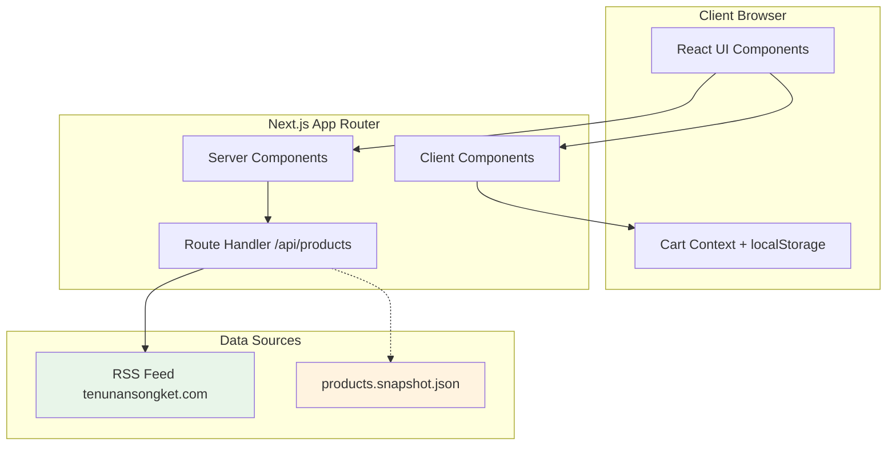

# Design Document: TenunanSongket Store

## Overview

TenunanSongket Store adalah aplikasi e-commerce frontend demo yang dibangun dengan Next.js App Router, TypeScript, Tailwind CSS, dan shadcn/ui. Aplikasi ini menampilkan produk tenunan songket dengan desain modern minimalis dan aksen warna marun (#7A1F3D).

Arsitektur mengutamakan Server Components untuk performa optimal, dengan Client Components hanya untuk fitur interaktif seperti cart dan filter. Data produk diambil dari RSS feed dengan fallback ke snapshot JSON.

## Architecture



### Rendering Strategy

| Page | Component Type | Reason |
|------|---------------|--------|
| Home | Server | Static content, SEO |
| Product Listing | Server + Client | Server for data, Client for filters |
| Product Detail | Server | SEO, product data |
| Cart | Client | Interactive, localStorage |
| Checkout | Client | Form state management |
| Success | Server | Static confirmation |
| Account | Client | Form interactions |

## Components and Interfaces

### Layout Components

```typescript
// components/layout/Header.tsx
interface HeaderProps {
  // No props - uses internal state for mobile menu
}

// Features:
// - Logo (left)
// - Search bar (center, desktop only)
// - Category dropdown, Cart icon, Account link (right)
// - Mobile: Hamburger → Sheet navigation
// - Sticky positioning
```

```typescript
// components/layout/Footer.tsx
interface FooterProps {
  // No props - static content
}

// Features:
// - Navigation links (Cara Order, Tentang, Kontak, Social)
// - Brand story section
// - Subtle songket pattern background
```

### Product Components

```typescript
// components/product/ProductCard.tsx
interface ProductCardProps {
  product: Product;
  onAddToCart?: (product: Product) => void;
}

// Features:
// - Product image with hover effect
// - Title, price, rating, sold count
// - Quick add to cart button
// - Link to product detail
```

```typescript
// components/product/ProductGrid.tsx
interface ProductGridProps {
  products: Product[];
  loading?: boolean;
  emptyMessage?: string;
}

// Features:
// - Responsive grid (1-4 columns based on viewport)
// - Skeleton loading state
// - Empty state handling
```

```typescript
// components/product/ProductGallery.tsx
interface ProductGalleryProps {
  images: string[];
  productTitle: string;
}

// Features:
// - Main image carousel
// - Thumbnail navigation
// - Zoom on hover (optional)
```

### Filter Components

```typescript
// components/filters/FilterSidebar.tsx
interface FilterSidebarProps {
  categories: string[];
  selectedCategory?: string;
  priceRange: [number, number];
  maxPrice: number;
  inStockOnly: boolean;
  onFilterChange: (filters: FilterState) => void;
}

interface FilterState {
  category?: string;
  minPrice?: number;
  maxPrice?: number;
  inStock?: boolean;
  sort?: 'newest' | 'cheapest' | 'bestselling';
}
```

```typescript
// components/filters/FilterSheetMobile.tsx
interface FilterSheetMobileProps extends FilterSidebarProps {
  open: boolean;
  onOpenChange: (open: boolean) => void;
}

// Mobile version using Sheet component
```

### Cart Components

```typescript
// components/cart/CartProvider.tsx
interface CartContextValue {
  items: CartItem[];
  addItem: (product: Product, quantity?: number) => void;
  removeItem: (productId: string) => void;
  updateQuantity: (productId: string, quantity: number) => void;
  clearCart: () => void;
  totalItems: number;
  subtotal: number;
}

interface CartItem {
  product: Product;
  quantity: number;
}
```

```typescript
// components/cart/CartItemCard.tsx
interface CartItemCardProps {
  item: CartItem;
  onUpdateQuantity: (quantity: number) => void;
  onRemove: () => void;
}
```

### Checkout Components

```typescript
// components/checkout/CheckoutStepper.tsx
interface CheckoutStepperProps {
  currentStep: 1 | 2 | 3;
  onStepChange: (step: 1 | 2 | 3) => void;
}

// Steps: 1=Address, 2=Shipping, 3=Summary
```

```typescript
// components/checkout/AddressForm.tsx
interface AddressFormProps {
  onSubmit: (address: ShippingAddress) => void;
  initialData?: ShippingAddress;
}

interface ShippingAddress {
  fullName: string;
  phone: string;
  address: string;
  city: string;
  province: string;
  postalCode: string;
}
```

## Data Models

### Product Type

```typescript
// lib/types.ts
export type Product = {
  id: string;
  slug: string;
  title: string;
  description: string;
  image?: string;
  price: number;
  currency: "IDR";
  category: string;
  tags: string[];
  inStock: boolean;
  rating: number;
  sold: number;
  createdAt?: string;
  sourceUrl: string;
};
```

### Cart Types

```typescript
export interface CartItem {
  product: Product;
  quantity: number;
}

export interface CartState {
  items: CartItem[];
  lastUpdated: string;
}
```

### Checkout Types

```typescript
export interface ShippingAddress {
  fullName: string;
  phone: string;
  address: string;
  city: string;
  province: string;
  postalCode: string;
}

export interface ShippingOption {
  id: string;
  name: string;
  price: number;
  estimatedDays: string;
}

export interface OrderSummary {
  items: CartItem[];
  subtotal: number;
  shipping: number;
  tax: number;
  total: number;
  shippingAddress: ShippingAddress;
  shippingOption: ShippingOption;
}
```

### API Response Types

```typescript
export interface ProductsResponse {
  products: Product[];
  total: number;
  page: number;
  pageSize: number;
  source: 'rss' | 'snapshot';
}

export interface ProductFilters {
  q?: string;
  category?: string;
  minPrice?: number;
  maxPrice?: number;
  inStock?: boolean;
  sort?: 'newest' | 'cheapest' | 'bestselling';
  page?: number;
}
```

### RSS Parsing

```typescript
// lib/rss.ts
export interface RSSItem {
  guid?: string;
  link: string;
  title: string;
  description?: string;
  'content:encoded'?: string;
  pubDate?: string;
  enclosure?: { url: string };
  'media:content'?: { url: string };
}

export function parseRSSToProducts(xml: string): Product[];
export function generateConsistentPrice(id: string): number;
export function generateConsistentRating(id: string): number;
export function extractCategory(title: string, description: string): string;
```


## Correctness Properties

*A property is a characteristic or behavior that should hold true across all valid executions of a system—essentially, a formal statement about what the system should do. Properties serve as the bridge between human-readable specifications and machine-verifiable correctness guarantees.*

### Property 1: Product Filtering Returns Matching Results

*For any* list of products and any combination of filter criteria (category, price range, stock availability, search query), the filtered results SHALL only contain products that match ALL specified criteria.

**Validates: Requirements 3.4, 3.7**

### Property 2: Product Sorting Produces Correct Order

*For any* list of products and any sort option (newest, cheapest, bestselling), the sorted results SHALL be ordered correctly according to the sort criteria:
- newest: descending by createdAt
- cheapest: ascending by price
- bestselling: descending by sold count

**Validates: Requirements 3.5**

### Property 3: Cart Quantity Update Reflects in State

*For any* cart with items and any valid quantity update (quantity > 0), updating an item's quantity SHALL result in the cart state reflecting the new quantity for that specific item while other items remain unchanged.

**Validates: Requirements 5.2**

### Property 4: Cart Item Removal Excludes Item

*For any* cart with items and any item removal operation, the resulting cart SHALL NOT contain the removed item, and all other items SHALL remain in the cart.

**Validates: Requirements 5.3**

### Property 5: Cart Subtotal Equals Sum of Item Totals

*For any* cart with items, the subtotal SHALL equal the sum of (price × quantity) for all items in the cart.

**Validates: Requirements 5.4**

### Property 6: Cart Persistence Round-Trip

*For any* valid cart state, serializing to localStorage and deserializing back SHALL produce an equivalent cart state with the same items and quantities.

**Validates: Requirements 5.5**

### Property 7: Checkout Form Validation Rejects Incomplete Data

*For any* checkout form submission with missing required fields (fullName, phone, address, city, province, postalCode), validation SHALL fail and prevent progression to the next step.

**Validates: Requirements 6.6**

### Property 8: RSS to Product Mapping Produces Valid Products

*For any* valid RSS XML with items, parsing SHALL produce Product objects where each product has:
- non-empty id (from guid or hash of link)
- non-empty slug (from title)
- non-empty title
- valid price (number > 0)
- valid rating (0-5)
- image extracted from enclosure/media:content or placeholder

**Validates: Requirements 9.2, 9.5**

### Property 9: Consistent Value Generation (Idempotence)

*For any* product id, calling generateConsistentPrice(id), generateConsistentRating(id), and generateConsistentSold(id) multiple times SHALL always return the same values.

**Validates: Requirements 9.3**

## Error Handling

### API Error Handling

| Error Scenario | Handling Strategy |
|----------------|-------------------|
| RSS feed timeout | Return snapshot data with `source: 'snapshot'` |
| RSS feed 404/500 | Return snapshot data with `source: 'snapshot'` |
| Invalid XML | Return snapshot data, log error |
| Empty RSS feed | Return empty array or snapshot |
| Network error | Return snapshot data |

### UI Error Handling

| Error Scenario | Handling Strategy |
|----------------|-------------------|
| Product not found | Display 404 page with back to listing CTA |
| Empty product list | Display "No products found" with clear filters CTA |
| Image load failure | Display placeholder image |
| Cart localStorage corrupt | Reset cart, show notification |
| Form validation error | Display inline error messages |

### Loading States

| Component | Loading State |
|-----------|---------------|
| Product Grid | Skeleton cards (6-12 items) |
| Product Detail | Skeleton for image, title, price |
| Cart | Skeleton for item list |
| Filters | Disabled state during fetch |

## Testing Strategy

### Testing Framework

- **Unit Tests**: Vitest
- **Property-Based Tests**: fast-check
- **Component Tests**: React Testing Library
- **E2E Tests**: Playwright (optional, for critical flows)

### Unit Tests

Unit tests focus on specific examples and edge cases:

1. **RSS Parsing**
   - Parse valid RSS XML
   - Handle missing fields gracefully
   - Extract images from different sources

2. **Cart Operations**
   - Add item to empty cart
   - Add duplicate item (increase quantity)
   - Remove last item (empty cart)
   - Update quantity to zero (remove)

3. **Filter Logic**
   - Single filter application
   - Multiple filters combined
   - Empty filter results

4. **Price Formatting**
   - Format IDR currency
   - Handle large numbers

### Property-Based Tests

Property tests verify universal properties across many generated inputs. Each test runs minimum 100 iterations.

| Property | Test Description | Tag |
|----------|------------------|-----|
| Property 1 | Generate random products and filters, verify all results match criteria | Feature: tenunan-songket-store, Property 1: Product filtering |
| Property 2 | Generate random products, verify sort order is correct | Feature: tenunan-songket-store, Property 2: Product sorting |
| Property 3 | Generate random cart and quantity updates, verify state | Feature: tenunan-songket-store, Property 3: Cart quantity update |
| Property 4 | Generate random cart and removals, verify item excluded | Feature: tenunan-songket-store, Property 4: Cart item removal |
| Property 5 | Generate random cart, verify subtotal calculation | Feature: tenunan-songket-store, Property 5: Cart subtotal |
| Property 6 | Generate random cart, serialize/deserialize, verify equality | Feature: tenunan-songket-store, Property 6: Cart persistence |
| Property 7 | Generate incomplete form data, verify validation fails | Feature: tenunan-songket-store, Property 7: Form validation |
| Property 8 | Generate valid RSS XML, verify Product objects are valid | Feature: tenunan-songket-store, Property 8: RSS parsing |
| Property 9 | Generate random ids, call generators multiple times, verify same output | Feature: tenunan-songket-store, Property 9: Idempotence |

### Test File Structure

```
/__tests__
  /unit
    rss.test.ts
    cart.test.ts
    filters.test.ts
    utils.test.ts
  /property
    filtering.property.test.ts
    sorting.property.test.ts
    cart.property.test.ts
    validation.property.test.ts
    rss.property.test.ts
  /components
    ProductCard.test.tsx
    CartItemCard.test.tsx
    FilterSidebar.test.tsx
```

### Test Coverage Goals

- Core logic (cart, filters, RSS parsing): 90%+ coverage
- UI components: Key interactions tested
- Property tests: All 9 properties implemented
